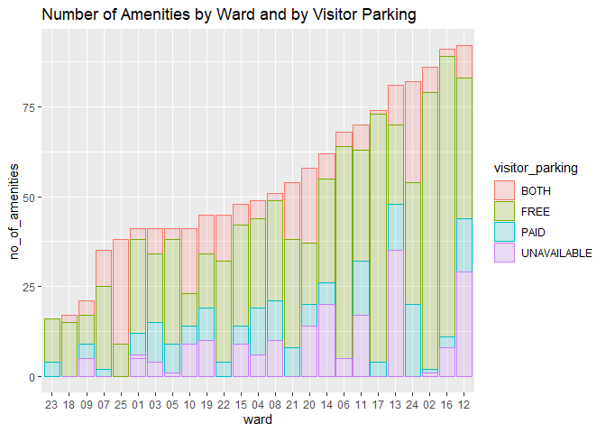
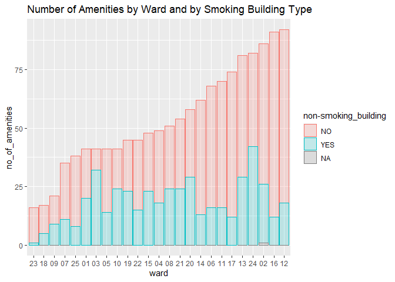

Mini Data Analysis 3
================
Jana Osea
October 28, 2021

# Setup

Begin by loading your data and the tidyverse package below:

``` r
suppressPackageStartupMessages(library(datateachr)) 
suppressPackageStartupMessages(library(tidyverse))
suppressPackageStartupMessages(library(forcats))
suppressPackageStartupMessages(library(tidyr))
suppressPackageStartupMessages(library(dplyr))
suppressPackageStartupMessages(library(ggridges))
suppressPackageStartupMessages(library(ggplot2))
suppressPackageStartupMessages(library(kableExtra))
suppressPackageStartupMessages(library(lubridate))
suppressPackageStartupMessages(library(broom))
suppressPackageStartupMessages(library(here))
```

After loading the appropriate packages, I load the data as processed in
the previous milestone.

``` r
# LOAD DATA
# count number of amenities by splitting words
no_of_amenities <- rep(0, nrow(apt_buildings))
for(i in 1:nrow(apt_buildings)) {
  amenities = apt_buildings$amenities[i]
  if(!is.na(amenities)) {
    no_of_amenities[i] = length(str_split(amenities, " ,")[[1]])
  }
}

# determine outliers
outliers <- boxplot.stats(apt_buildings$no_of_units)$out 


# bind the number of amenities as a new column in the apt_buildings tibble df
cbind(apt_buildings, no_of_amenities) -> apt_buildings

apt_buildings %>%
  select(id,
         no_of_amenities,
         property_type,
         visitor_parking,
         ward,
         year_built,
         `non-smoking_building`,
         no_of_units,
         pets_allowed,
         heating_type,
         balconies,
         air_conditioning
         ) %>%
  filter(!no_of_units %in% outliers) %>%
  mutate(year_built = year(as_date(year_built)))-> apt_buildings
```

## Research Questions

1.  Is there a downward or upward trend in the number non-smoking units
    built from 1910 to 2020?
2.  Does the number of amenities change by ward and by another apartment
    characteristic? Is there an interaction between this characteristic
    and ward on the number of amenities?

# Exercise 1: Special Data Types

**Task 1**: I choose to reorder the column *ward* in the *apt\_building*
data set so that I am able to better visualize which wards have more
total number of amenities. It also allows us to see which wards have
similar total number of amenities.

``` r
apt_buildings %>%
  group_by(ward) %>%
  summarise(no_of_amenities = sum(no_of_amenities)) %>%
  mutate(ward = fct_reorder(ward, no_of_amenities)) %>%
  ggplot(aes(x=ward, y=no_of_amenities, color=ward, fill=ward)) + 
  geom_bar(stat="identity", alpha=0.2) + 
  ggtitle("Number of Amenities by Ward")
```

<!-- -->

``` r
apt_buildings %>%
  group_by(ward) %>%
  summarise(no_of_amenities = sum(no_of_amenities)) %>%
  mutate(ward = fct_reorder(ward, no_of_amenities)) -> apt_buildings1
```

**Task 2**: The column *visitor\_parking* column has *UNAVAILABLE* as an
option, however there are also data points with *NA* as input. Hence, I
used the `fct_collapse` along with `addNA` function in order to combine
the *UNAVAILABLE* option with the *NA* option. This allows us to still
include the number of NA’s into the analysis.

``` r
# create tibble 
apt_buildings %>%
  group_by(ward, visitor_parking) %>%
  summarise(no_of_amenities = sum(no_of_amenities), 
            no_of_unit = sum(no_of_units)) -> apt_buildings2
```

    ## `summarise()` has grouped output by 'ward'. You can override using the `.groups` argument.

``` r
# change factor levels of ward to be reordered the same as task 1
apt_buildings2$ward <- factor(apt_buildings2$ward, 
                              levels(apt_buildings1$ward))

# collapse factor level of visitor parking
addNA(factor(apt_buildings2$visitor_parking)) %>%
  fct_collapse(UNAVAILABLE = c("UNAVAILABLE", NA)) -> visitor_parking
apt_buildings2$visitor_parking <-  factor(visitor_parking)

# plot num of amenities by ward and visitor parking 
apt_buildings2 %>% 
  ggplot(aes(x=ward, y=no_of_amenities, fill=visitor_parking, color=visitor_parking)) +
  geom_bar(stat="identity", alpha=0.2) +
  ggtitle("Number of Amenities by Ward and by Visitor Parking")
```

<!-- -->

# Exercise 2: Modelling

## 2.0

**Research Question**:Does the number of amenities change by ward and by
another apartment characteristic? Is there an interaction between this
characteristic and ward on the number of amenities?

**Variable of interest**: Number of amenities

## 2.1

In this case, after looking at the plot of number of amenities by ward
and visitor parking type, I compared it with the plot for other
apartment characteristics like air venting type, allowed pets, and
smoking type. I prefer to explore the smoking type and ward effect on
the number of amenities as it is more interesting and a difference
between the 2 effects is more apparent visually. Below is a bar chart
similar to the bar chart produced in **Task 2** but with smoking
building type.

``` r
# create tibble 
apt_buildings %>%
  group_by(ward, `non-smoking_building`) %>%
  summarise(no_of_amenities = sum(no_of_amenities), 
            no_of_unit = sum(no_of_units)) -> apt_buildings3
```

    ## `summarise()` has grouped output by 'ward'. You can override using the `.groups` argument.

``` r
# reorder factor by increasing wards
apt_buildings3$ward <- factor(apt_buildings3$ward, 
                              levels(apt_buildings1$ward))

apt_buildings3 %>%
  ggplot(aes(x=ward, y=no_of_amenities, fill=`non-smoking_building`, color=`non-smoking_building`)) +
  geom_bar(stat="identity", alpha=0.2) +
  ggtitle("Number of Amenities by Ward and by Smoking Building Type")
```

<!-- -->

Hence, I will perform a TWO-way ANOVA to test if:

1.  there is a difference in the mean number of amenities at any level
    of the ward variable.
2.  there is a difference in the mean number of amenities at any level
    of the smoking building type variable.
3.  the effect of the ward variable does depend on the effect of the
    smoking building type variable (a.k.a. interaction effect).

The code to perform the test and the output is shown below.

``` r
my_aov <- aov(no_of_amenities ~ ward * `non-smoking_building`, 
              data=apt_buildings)
my_aov
```

    ## Call:
    ##    aov(formula = no_of_amenities ~ ward * `non-smoking_building`, 
    ##     data = apt_buildings)
    ## 
    ## Terms:
    ##                      ward `non-smoking_building` ward:`non-smoking_building`
    ## Sum of Squares   239.6591                 1.0256                     57.0057
    ## Deg. of Freedom        24                      1                          24
    ##                 Residuals
    ## Sum of Squares  2240.0732
    ## Deg. of Freedom      3105
    ## 
    ## Residual standard error: 0.8493766
    ## Estimated effects may be unbalanced
    ## 92 observations deleted due to missingness

## 2.2

I will use the *p*-value as a way to determine the results of the test
using the `broom` package.

``` r
my_aov_tidy <- tidy(my_aov)
my_aov_tidy
```

    ## # A tibble: 4 x 6
    ##   term                           df   sumsq meansq statistic   p.value
    ##   <chr>                       <dbl>   <dbl>  <dbl>     <dbl>     <dbl>
    ## 1 ward                           24  240.    9.99      13.8   7.14e-53
    ## 2 `non-smoking_building`          1    1.03  1.03       1.42  2.33e- 1
    ## 3 ward:`non-smoking_building`    24   57.0   2.38       3.29  1.13e- 7
    ## 4 Residuals                    3105 2240.    0.721     NA    NA

``` r
my_aov_tidy$p.value
```

    ## [1] 7.142548e-53 2.332375e-01 1.131079e-07           NA

Using an *α* = 0.05, we conclude that the first and third *p*-values are
significant. Hence, we conclude that:

-   the mean number of amenities is not the same for at least one ward
    level
-   there is an interaction effect; the effect of the ward variable on
    the mean number of amenities is affected by the effect of the
    smoking building type

# Exercise 3: Reading and writing data

## 3.1

I create the `output` folder in my project directory using the code
below. However, I have already previously ran this code and so as to not
repeat the folder creation process, I put them as comments.

``` r
# here::here()
# dir.create(here::here("output"))
```

I store the summary table from exercise 1.2.1.1 of milestone 2 of my
[mini data
analysis](https://github.com/stat545ubc-2021/jana-mini-data-analysis).

``` r
outliers <- boxplot.stats(apt_buildings$no_of_units)$out 

# 1.2.1.1 Task 1: Summary Statistics
apt_buildings %>% 
  filter(!no_of_units %in% outliers) %>% # get rid of outliers
  group_by(property_type) %>%
  summarise(
    count = n(),
    mean = mean(no_of_units),
    sum = sum(no_of_units),
  ) -> apt_buildings_summary

write_csv(apt_buildings_summary, here("output", "m2-ex1.2-summary.csv"))
```

## 3.2

I save the `my_tidy_aov` as a R binary file (an RDS) using the code
below.

``` r
saveRDS(my_aov_tidy, here::here("output/m3-ex2.2-anova.rda"))
```

Then I read the R binary file and save it in the `my_aov_tidy_rds`
variable using the code below.

``` r
my_aov_tidy_rds <- readRDS(here::here("output/m3-ex2.2-anova.rda"))
my_aov_tidy_rds
```

    ## # A tibble: 4 x 6
    ##   term                           df   sumsq meansq statistic   p.value
    ##   <chr>                       <dbl>   <dbl>  <dbl>     <dbl>     <dbl>
    ## 1 ward                           24  240.    9.99      13.8   7.14e-53
    ## 2 `non-smoking_building`          1    1.03  1.03       1.42  2.33e- 1
    ## 3 ward:`non-smoking_building`    24   57.0   2.38       3.29  1.13e- 7
    ## 4 Residuals                    3105 2240.    0.721     NA    NA
