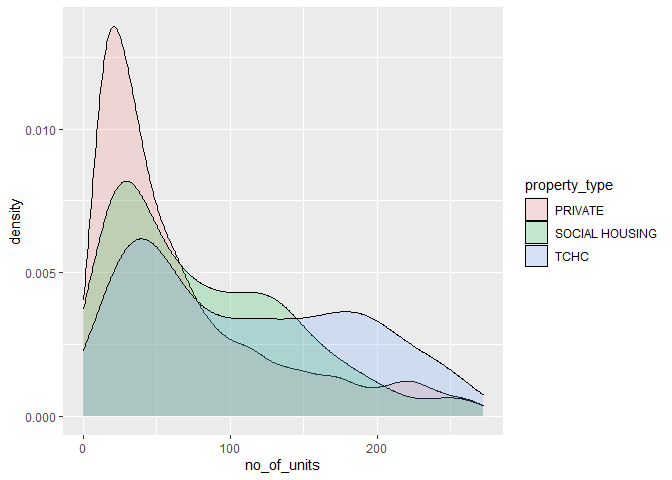
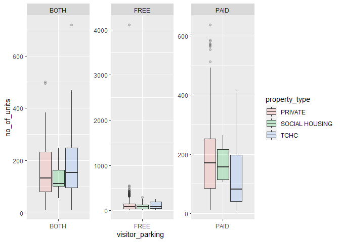

# 0 Introduction

This file goes through my exploration of different data sets in the `datateachr` package. I will look at 7 data sets as described [here](https://stat545.stat.ubc.ca/mini-project/mini-project-1/). I will be documenting how I choose my final data set and then I will perform various data exploration techniques to this data set in order to create 4 research questions motivated by the exploration.

# 1 Choose Favorite Data set

## 1.1 Choose 4 Data sets


From an initial pass through of the description of the various data set, I am most interested in the following 4 data sets:

1. *apt_buildings*
2. *building_permits*
3. *parking_meters*
4. *vancouver_trees*

## 1.2 Exploring Attributes of the 4 Datasets

### 1.2.1 *apt_buildings*

```r
str(apt_buildings)
```

```
## tibble [3,455 x 37] (S3: tbl_df/tbl/data.frame)
##  $ id                              : num [1:3455] 10359 10360 10361 10362 10363 ...
##  $ air_conditioning                : chr [1:3455] "NONE" "NONE" "NONE" "NONE" ...
##  $ amenities                       : chr [1:3455] "Outdoor rec facilities" "Outdoor pool" NA NA ...
##  $ balconies                       : chr [1:3455] "YES" "YES" "YES" "YES" ...
##  $ barrier_free_accessibilty_entr  : chr [1:3455] "YES" "NO" "NO" "YES" ...
##  $ bike_parking                    : chr [1:3455] "0 indoor parking spots and 10 outdoor parking spots" "0 indoor parking spots and 34 outdoor parking spots" "Not Available" "Not Available" ...
##  $ exterior_fire_escape            : chr [1:3455] "NO" "NO" "NO" "YES" ...
##  $ fire_alarm                      : chr [1:3455] "YES" "YES" "YES" "YES" ...
##  $ garbage_chutes                  : chr [1:3455] "YES" "YES" "NO" "NO" ...
##  $ heating_type                    : chr [1:3455] "HOT WATER" "HOT WATER" "HOT WATER" "HOT WATER" ...
##  $ intercom                        : chr [1:3455] "YES" "YES" "YES" "YES" ...
##  $ laundry_room                    : chr [1:3455] "YES" "YES" "YES" "YES" ...
##  $ locker_or_storage_room          : chr [1:3455] "NO" "YES" "YES" "YES" ...
##  $ no_of_elevators                 : num [1:3455] 3 3 0 1 0 0 0 2 4 2 ...
##  $ parking_type                    : chr [1:3455] "Underground Garage , Garage accessible thru buildg" "Underground Garage , Garage accessible thru buildg , Surface Parking" "Underground Garage , Garage accessible thru buildg , Surface Parking" "Ground Level Garage , Surface Parking" ...
##  $ pets_allowed                    : chr [1:3455] "YES" "YES" "YES" "YES" ...
##  $ prop_management_company_name    : chr [1:3455] NA "SCHICKEDANZ BROS. PROPERTIES" NA "FREIMAN INVESTMENTS" ...
##  $ property_type                   : chr [1:3455] "PRIVATE" "PRIVATE" "PRIVATE" "PRIVATE" ...
##  $ rsn                             : num [1:3455] 4154812 4154815 4155295 4155309 4155318 ...
##  $ separate_gas_meters             : chr [1:3455] "NO" "NO" "NO" "NO" ...
##  $ separate_hydro_meters           : chr [1:3455] "YES" "YES" "YES" "YES" ...
##  $ separate_water_meters           : chr [1:3455] "NO" "NO" "NO" "NO" ...
##  $ site_address                    : chr [1:3455] "65  FOREST MANOR RD" "70  CLIPPER RD" "2651  BLOOR ST W" "22  BURNHAMTHORPE RD" ...
##  $ sprinkler_system                : chr [1:3455] "YES" "YES" "NO" "YES" ...
##  $ visitor_parking                 : chr [1:3455] "PAID" "FREE" "UNAVAILABLE" "UNAVAILABLE" ...
##  $ ward                            : chr [1:3455] "17" "17" "03" "03" ...
##  $ window_type                     : chr [1:3455] "DOUBLE PANE" "DOUBLE PANE" "DOUBLE PANE" "DOUBLE PANE" ...
##  $ year_built                      : num [1:3455] 1967 1970 1927 1959 1943 ...
##  $ year_registered                 : num [1:3455] 2017 2017 2017 2017 2017 ...
##  $ no_of_storeys                   : num [1:3455] 17 14 4 5 4 4 4 7 32 4 ...
##  $ emergency_power                 : chr [1:3455] "NO" "YES" "NO" "NO" ...
##  $ non-smoking_building            : chr [1:3455] "YES" "NO" "YES" "YES" ...
##  $ no_of_units                     : num [1:3455] 218 206 34 42 25 34 14 105 571 171 ...
##  $ no_of_accessible_parking_spaces : num [1:3455] 8 10 20 42 12 0 5 1 1 6 ...
##  $ facilities_available            : chr [1:3455] "Recycling bins" "Green Bin / Organics" "Green Bin / Organics" "Green Bin / Organics" ...
##  $ cooling_room                    : chr [1:3455] "NO" "NO" "NO" "NO" ...
##  $ no_barrier_free_accessible_units: num [1:3455] 2 0 0 42 0 NA 14 0 0 1 ...
```

### 1.2.2 *building_permits*

```r
str(building_permits)
```

```
## spec_tbl_df [20,680 x 14] (S3: spec_tbl_df/tbl_df/tbl/data.frame)
##  $ permit_number              : chr [1:20680] "BP-2016-02248" "BU468090" "DB-2016-04450" "DB-2017-00131" ...
##  $ issue_date                 : Date[1:20680], format: "2017-02-01" "2017-02-01" ...
##  $ project_value              : num [1:20680] 0 0 35000 15000 181178 ...
##  $ type_of_work               : chr [1:20680] "Salvage and Abatement" "New Building" "Addition / Alteration" "Addition / Alteration" ...
##  $ address                    : chr [1:20680] "4378 W 9TH AVENUE, Vancouver, BC V6R 2C7" "1111 RICHARDS STREET, Vancouver, BC V1V 1V1" "3732 W 12TH AVENUE, Vancouver, BC V6R 2N6" "88 W PENDER STREET, Vancouver, BC V6B 6N9" ...
##  $ project_description        : chr [1:20680] NA NA NA NA ...
##  $ building_contractor        : chr [1:20680] NA NA NA "Mercury Contracting Ltd" ...
##  $ building_contractor_address: chr [1:20680] NA NA NA "88 W PENDER ST  \r\nUnit 2069\r\nVancouver, BC  V6B 6N9" ...
##  $ applicant                  : chr [1:20680] "Raffaele & Associates DBA: Raffaele and Associates" "MAX KERR" "Peter  Nicol" "Aaron Vaughan DBA: Mercury Contracting" ...
##  $ applicant_address          : chr [1:20680] "2642 East Hastings\r\nVancouver, BC  V5K 1Z6" "BRENHILL DEVELOPMENTS LTD\r\n487 HELMCKEN ST\r\nVANCOUVER, BC  V5T1R8" "3722 W 12th Ave\r\nVancouver, BC  V6R 2N6" "2097-88 W Pender St\r\nVancouver, BC  V6B 6N9" ...
##  $ property_use               : chr [1:20680] "Dwelling Uses" "Dwelling Uses" "Dwelling Uses" "Office Uses,Retail Uses" ...
##  $ specific_use_category      : chr [1:20680] "One-Family Dwelling" "Multiple Dwelling" "One-Family Dwelling" "General Office, Retail Store" ...
##  $ year                       : num [1:20680] 2017 2017 2017 2017 2017 ...
##  $ bi_id                      : num [1:20680] 524 535 539 541 543 546 547 548 549 550 ...
##  - attr(*, "spec")=
##   .. cols(
##   ..   PermitNumber = col_character(),
##   ..   IssueDate = col_date(format = ""),
##   ..   ProjectValue = col_double(),
##   ..   TypeOfWork = col_character(),
##   ..   Address = col_character(),
##   ..   ProjectDescription = col_character(),
##   ..   BuildingContractor = col_character(),
##   ..   BuildingContractorAddress = col_character(),
##   ..   Applicant = col_character(),
##   ..   ApplicantAddress = col_character(),
##   ..   PropertyUse = col_character(),
##   ..   SpecificUseCategory = col_character(),
##   ..   Year = col_double(),
##   ..   BI_ID = col_double()
##   .. )
```
  
### 1.2.3 *parking_meters*

```r
str(parking_meters)
```

```
## tibble [10,032 x 22] (S3: tbl_df/tbl/data.frame)
##  $ meter_head    : chr [1:10032] "Twin" "Pay Station" "Twin" "Single" ...
##  $ r_mf_9a_6p    : chr [1:10032] "$2.00" "$1.00" "$1.00" "$1.00" ...
##  $ r_mf_6p_10    : chr [1:10032] "$4.00" "$1.00" "$1.00" "$1.00" ...
##  $ r_sa_9a_6p    : chr [1:10032] "$2.00" "$1.00" "$1.00" "$1.00" ...
##  $ r_sa_6p_10    : chr [1:10032] "$4.00" "$1.00" "$1.00" "$1.00" ...
##  $ r_su_9a_6p    : chr [1:10032] "$2.00" "$1.00" "$1.00" "$1.00" ...
##  $ r_su_6p_10    : chr [1:10032] "$4.00" "$1.00" "$1.00" "$1.00" ...
##  $ rate_misc     : chr [1:10032] NA "$ .50" NA NA ...
##  $ time_in_effect: chr [1:10032] "METER IN EFFECT: 9:00 AM TO 10:00 PM" "METER IN EFFECT: 9:00 AM TO 10:00 PM" "METER IN EFFECT: 9:00 AM TO 10:00 PM" "METER IN EFFECT: 9:00 AM TO 10:00 PM" ...
##  $ t_mf_9a_6p    : chr [1:10032] "2 Hr" "10 Hrs" "2 Hr" "2 Hr" ...
##  $ t_mf_6p_10    : chr [1:10032] "4 Hr" "10 Hrs" "4 Hr" "4 Hr" ...
##  $ t_sa_9a_6p    : chr [1:10032] "2 Hr" "10 Hrs" "2 Hr" "2 Hr" ...
##  $ t_sa_6p_10    : chr [1:10032] "4 Hr" "10 Hrs" "4 Hr" "4 Hr" ...
##  $ t_su_9a_6p    : chr [1:10032] "2 Hr" "10 Hrs" "2 Hr" "2 Hr" ...
##  $ t_su_6p_10    : chr [1:10032] "4 Hr" "10 Hrs" "4 Hr" "4 Hr" ...
##  $ time_misc     : chr [1:10032] NA "No Time Limit" NA NA ...
##  $ credit_card   : chr [1:10032] "No" "Yes" "No" "No" ...
##  $ pay_phone     : chr [1:10032] "66890" "59916" "57042" "57159" ...
##  $ longitude     : num [1:10032] -123 -123 -123 -123 -123 ...
##  $ latitude      : num [1:10032] 49.3 49.3 49.3 49.3 49.3 ...
##  $ geo_local_area: chr [1:10032] "West End" "Strathcona" "Riley Park" "West Point Grey" ...
##  $ meter_id      : chr [1:10032] "670805" "471405" "C80145" "D03704" ...
```

### 1.2.4 *vancouver_trees*


```r
str(vancouver_trees)
```

```
## tibble [146,611 x 20] (S3: tbl_df/tbl/data.frame)
##  $ tree_id           : num [1:146611] 149556 149563 149579 149590 149604 ...
##  $ civic_number      : num [1:146611] 494 450 4994 858 5032 ...
##  $ std_street        : chr [1:146611] "W 58TH AV" "W 58TH AV" "WINDSOR ST" "E 39TH AV" ...
##  $ genus_name        : chr [1:146611] "ULMUS" "ZELKOVA" "STYRAX" "FRAXINUS" ...
##  $ species_name      : chr [1:146611] "AMERICANA" "SERRATA" "JAPONICA" "AMERICANA" ...
##  $ cultivar_name     : chr [1:146611] "BRANDON" NA NA "AUTUMN APPLAUSE" ...
##  $ common_name       : chr [1:146611] "BRANDON ELM" "JAPANESE ZELKOVA" "JAPANESE SNOWBELL" "AUTUMN APPLAUSE ASH" ...
##  $ assigned          : chr [1:146611] "N" "N" "N" "Y" ...
##  $ root_barrier      : chr [1:146611] "N" "N" "N" "N" ...
##  $ plant_area        : chr [1:146611] "N" "N" "4" "4" ...
##  $ on_street_block   : num [1:146611] 400 400 4900 800 5000 500 4900 4900 4900 700 ...
##  $ on_street         : chr [1:146611] "W 58TH AV" "W 58TH AV" "WINDSOR ST" "E 39TH AV" ...
##  $ neighbourhood_name: chr [1:146611] "MARPOLE" "MARPOLE" "KENSINGTON-CEDAR COTTAGE" "KENSINGTON-CEDAR COTTAGE" ...
##  $ street_side_name  : chr [1:146611] "EVEN" "EVEN" "EVEN" "EVEN" ...
##  $ height_range_id   : num [1:146611] 2 4 3 4 2 2 3 3 2 2 ...
##  $ diameter          : num [1:146611] 10 10 4 18 9 5 15 14 16 7.5 ...
##  $ curb              : chr [1:146611] "N" "N" "Y" "Y" ...
##  $ date_planted      : Date[1:146611], format: "1999-01-13" "1996-05-31" ...
##  $ longitude         : num [1:146611] -123 -123 -123 -123 -123 ...
##  $ latitude          : num [1:146611] 49.2 49.2 49.2 49.2 49.2 ...
```

## 1.3 Choose 2 Data sets

I am most interested in the *apt_buildings* and *vancouver_trees*. The *apt_buildings* has a lot of numerical variables such as *no_of_units* and *no_of_accessible_parking_space*. In addition, the categorical variables are easily understandable like *pets_allowed* and *parking_type*. I do not have to extrapolate their meanings unlike the *parking_meters* data set. This data set also contains time variables, *year_built* and *year_registered*, which can be used for time series analysis. There's a lot of possible relationships that can be explored in this data set.

*vancouver_trees* is also very interesting because it has exact *longitude* and *latitude* values for each tree which can be used for interesting geographic visualization. Similar to *apt_buildings*, it has a lot of numerical and categorical variables like *diameter* of the tree and the *species_name*. Various relationships can be explored using this data set. The date of when the trees were planted were also recorded which can be used for time series analysis.


## 1.4 Final Data set

For the 2 data sets above, a lot of research questions can be formed. For example, using the *apt_buildings* data set, we can ask the question *"does the proportion of smoking vs. non-smoking buildings change over the years?"*. Using the *vancouver_trees* data set, we can ask *"does the location affect the type of species of tree planted?"*

I am personally more interested in the changes of the apartment buildings over the years. I am also interested in exploring  relationship of various structural components of apartment buildings with each other. For example, the number of balconies and if pets are allowed. I am excited to see what we can explore with the *apt_buildings* data set.


# 2 Exploring the Data set

## 2.1/2.2 Using 4 Exercises (and Explanation)

### 2.2.1 Exercise 1

I plot the distribution of the number of units 


```r
# Plot the distribution of a numeric variable.
outliers <- boxplot.stats(apt_buildings$no_of_units)$out

apt_buildings %>%
  filter(!no_of_units %in% outliers) %>%
  ggplot(aes(x=no_of_units, fill=property_type)) +  
  geom_density(alpha=.2)
```

<!-- -->

```r
apt_buildings %>%
  filter(!no_of_units %in% outliers) %>%
  ggplot(aes(x=no_of_units, y=property_type)) +  
  geom_density_ridges(alpha=0.2, aes(fill=property_type)) 
```

```
## Picking joint bandwidth of 16.6
```

<!-- -->

### 2.2.2 Exercise 2:

```r
# Explore the relationship between 2 variables in a plot.
apt_buildings %>%
  filter(!is.na(`non-smoking_building`)) %>%
  mutate(year = as.Date(as.character(year_built), format="%Y")) %>%
  filter(year > as.Date("1910", format="%Y")) %>%
  ggplot(aes(x=year, y=no_of_units)) + 
  geom_bar(stat="identity", position="stack", alpha = 0.8, aes(fill=as.factor(`non-smoking_building`)))
```

<!-- -->

```r
apt_buildings %>%
  filter(!is.na(`non-smoking_building`)) %>%
  mutate(year = as.Date(as.character(year_built), format="%Y")) %>%
  filter(year > as.Date("1910", format="%Y")) %>%
  ggplot(aes(x=year, y=no_of_units)) + 
  geom_bar(stat="identity", position="fill", alpha = 0.8,aes(fill=`non-smoking_building`))
```

<!-- -->

### 2.2.3 Exercise 3:

```r
#Use a boxplot to look at the frequency of different observations within a single variable. You can do this for more than one variable if you wish!

apt_buildings %>%
  filter(!is.na(visitor_parking)) %>%
  filter(!is.na(property_type)) %>%
  filter(!visitor_parking == "UNAVAILABLE") %>%
  ggplot(aes(x=visitor_parking,y=no_of_units, fill=property_type)) +
  geom_boxplot(alpha=0.2) + 
  facet_wrap(~property_type, scale="free")
```

<!-- -->

### 2.2.4 Exercise 4:

```r
# Make a new tibble with a subset of your data, with variables and observations that you are interested in exploring.
apt_buildings %>%
  filter("Indoor pool" %in% amenities) %>%
  group_by(ward, property_type) %>%
  summarise(total_units = sum(no_of_units))
```

```
## `summarise()` has grouped output by 'ward'. You can override using the `.groups` argument.
```

```
## # A tibble: 74 x 3
## # Groups:   ward [26]
##    ward  property_type  total_units
##    <chr> <chr>                <dbl>
##  1 01    PRIVATE               6958
##  2 01    SOCIAL HOUSING         741
##  3 01    TCHC                  1874
##  4 02    PRIVATE              10963
##  5 02    SOCIAL HOUSING         495
##  6 02    TCHC                   478
##  7 03    PRIVATE              10864
##  8 03    SOCIAL HOUSING         515
##  9 03    TCHC                  2021
## 10 04    PRIVATE              13058
## # ... with 64 more rows
```

# 3 Research Question

