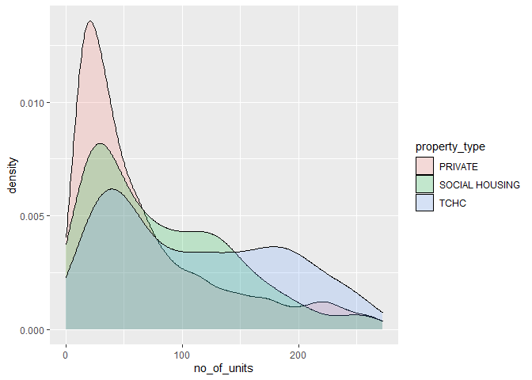
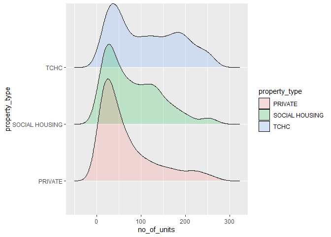
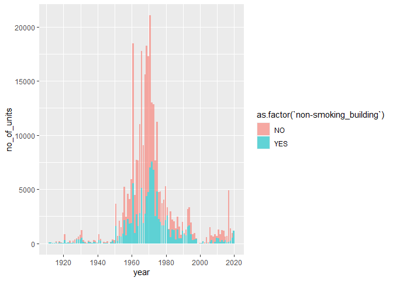
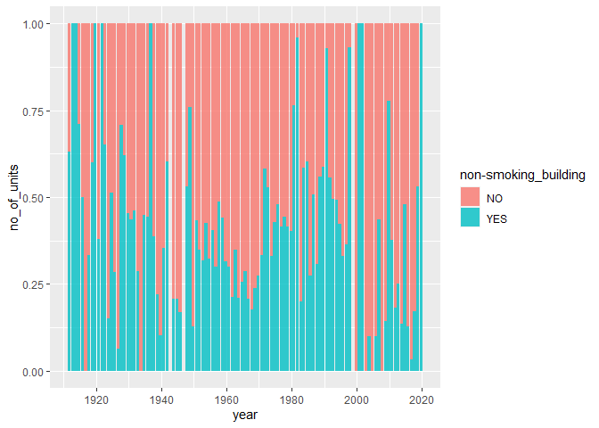
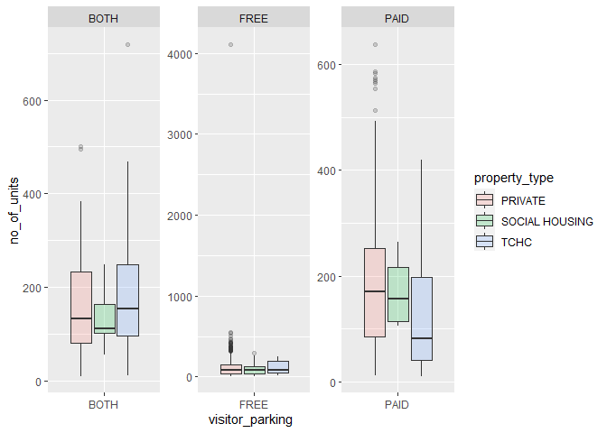

Mini Data Analysis 1
================
Jana Osea
October 5, 2021

# 0 Introduction

This file goes through my exploration of different data sets in the
`datateachr` package. I will look at 7 data sets as described
[here](https://stat545.stat.ubc.ca/mini-project/mini-project-1/). I will
be documenting how I choose my final data set and then I will perform
various data exploration techniques to this data set in order to create
4 research questions motivated by the exploration.

# 1 Choose Favorite Data set

## 1.1 Choose 4 Data sets

From an initial pass through of the description of the various data set,
I am most interested in the following 4 data sets:

1.  *apt\_buildings*
2.  *building\_permits*
3.  *parking\_meters*
4.  *vancouver\_trees*

## 1.2 Exploring Attributes of the 4 Datasets

### 1.2.1 *apt\_buildings*

``` r
glimpse(apt_buildings)
```

    ## Rows: 3,455
    ## Columns: 37
    ## $ id                               <dbl> 10359, 10360, 10361, 10362, 10363, 10~
    ## $ air_conditioning                 <chr> "NONE", "NONE", "NONE", "NONE", "NONE~
    ## $ amenities                        <chr> "Outdoor rec facilities", "Outdoor po~
    ## $ balconies                        <chr> "YES", "YES", "YES", "YES", "NO", "NO~
    ## $ barrier_free_accessibilty_entr   <chr> "YES", "NO", "NO", "YES", "NO", "NO",~
    ## $ bike_parking                     <chr> "0 indoor parking spots and 10 outdoo~
    ## $ exterior_fire_escape             <chr> "NO", "NO", "NO", "YES", "NO", NA, "N~
    ## $ fire_alarm                       <chr> "YES", "YES", "YES", "YES", "YES", "Y~
    ## $ garbage_chutes                   <chr> "YES", "YES", "NO", "NO", "NO", "NO",~
    ## $ heating_type                     <chr> "HOT WATER", "HOT WATER", "HOT WATER"~
    ## $ intercom                         <chr> "YES", "YES", "YES", "YES", "YES", "Y~
    ## $ laundry_room                     <chr> "YES", "YES", "YES", "YES", "YES", "Y~
    ## $ locker_or_storage_room           <chr> "NO", "YES", "YES", "YES", "NO", "YES~
    ## $ no_of_elevators                  <dbl> 3, 3, 0, 1, 0, 0, 0, 2, 4, 2, 0, 2, 2~
    ## $ parking_type                     <chr> "Underground Garage , Garage accessib~
    ## $ pets_allowed                     <chr> "YES", "YES", "YES", "YES", "YES", "Y~
    ## $ prop_management_company_name     <chr> NA, "SCHICKEDANZ BROS. PROPERTIES", N~
    ## $ property_type                    <chr> "PRIVATE", "PRIVATE", "PRIVATE", "PRI~
    ## $ rsn                              <dbl> 4154812, 4154815, 4155295, 4155309, 4~
    ## $ separate_gas_meters              <chr> "NO", "NO", "NO", "NO", "NO", "NO", "~
    ## $ separate_hydro_meters            <chr> "YES", "YES", "YES", "YES", "YES", "Y~
    ## $ separate_water_meters            <chr> "NO", "NO", "NO", "NO", "NO", "NO", "~
    ## $ site_address                     <chr> "65  FOREST MANOR RD", "70  CLIPPER R~
    ## $ sprinkler_system                 <chr> "YES", "YES", "NO", "YES", "NO", "NO"~
    ## $ visitor_parking                  <chr> "PAID", "FREE", "UNAVAILABLE", "UNAVA~
    ## $ ward                             <chr> "17", "17", "03", "03", "02", "02", "~
    ## $ window_type                      <chr> "DOUBLE PANE", "DOUBLE PANE", "DOUBLE~
    ## $ year_built                       <dbl> 1967, 1970, 1927, 1959, 1943, 1952, 1~
    ## $ year_registered                  <dbl> 2017, 2017, 2017, 2017, 2017, NA, 201~
    ## $ no_of_storeys                    <dbl> 17, 14, 4, 5, 4, 4, 4, 7, 32, 4, 4, 7~
    ## $ emergency_power                  <chr> "NO", "YES", "NO", "NO", "NO", "NO", ~
    ## $ `non-smoking_building`           <chr> "YES", "NO", "YES", "YES", "YES", "NO~
    ## $ no_of_units                      <dbl> 218, 206, 34, 42, 25, 34, 14, 105, 57~
    ## $ no_of_accessible_parking_spaces  <dbl> 8, 10, 20, 42, 12, 0, 5, 1, 1, 6, 12,~
    ## $ facilities_available             <chr> "Recycling bins", "Green Bin / Organi~
    ## $ cooling_room                     <chr> "NO", "NO", "NO", "NO", "NO", "NO", "~
    ## $ no_barrier_free_accessible_units <dbl> 2, 0, 0, 42, 0, NA, 14, 0, 0, 1, 25, ~

### 1.2.2 *building\_permits*

``` r
glimpse(building_permits)
```

    ## Rows: 20,680
    ## Columns: 14
    ## $ permit_number               <chr> "BP-2016-02248", "BU468090", "DB-2016-0445~
    ## $ issue_date                  <date> 2017-02-01, 2017-02-01, 2017-02-01, 2017-~
    ## $ project_value               <dbl> 0, 0, 35000, 15000, 181178, 0, 15000, 0, 6~
    ## $ type_of_work                <chr> "Salvage and Abatement", "New Building", "~
    ## $ address                     <chr> "4378 W 9TH AVENUE, Vancouver, BC V6R 2C7"~
    ## $ project_description         <chr> NA, NA, NA, NA, NA, NA, NA, NA, NA, NA, NA~
    ## $ building_contractor         <chr> NA, NA, NA, "Mercury Contracting Ltd", "08~
    ## $ building_contractor_address <chr> NA, NA, NA, "88 W PENDER ST  \r\nUnit 2069~
    ## $ applicant                   <chr> "Raffaele & Associates DBA: Raffaele and A~
    ## $ applicant_address           <chr> "2642 East Hastings\r\nVancouver, BC  V5K ~
    ## $ property_use                <chr> "Dwelling Uses", "Dwelling Uses", "Dwellin~
    ## $ specific_use_category       <chr> "One-Family Dwelling", "Multiple Dwelling"~
    ## $ year                        <dbl> 2017, 2017, 2017, 2017, 2017, 2017, 2017, ~
    ## $ bi_id                       <dbl> 524, 535, 539, 541, 543, 546, 547, 548, 54~

### 1.2.3 *parking\_meters*

``` r
glimpse(parking_meters)
```

    ## Rows: 10,032
    ## Columns: 22
    ## $ meter_head     <chr> "Twin", "Pay Station", "Twin", "Single", "Twin", "Twin"~
    ## $ r_mf_9a_6p     <chr> "$2.00", "$1.00", "$1.00", "$1.00", "$2.00", "$2.00", "~
    ## $ r_mf_6p_10     <chr> "$4.00", "$1.00", "$1.00", "$1.00", "$1.00", "$1.00", "~
    ## $ r_sa_9a_6p     <chr> "$2.00", "$1.00", "$1.00", "$1.00", "$2.00", "$2.00", "~
    ## $ r_sa_6p_10     <chr> "$4.00", "$1.00", "$1.00", "$1.00", "$1.00", "$1.00", "~
    ## $ r_su_9a_6p     <chr> "$2.00", "$1.00", "$1.00", "$1.00", "$2.00", "$2.00", "~
    ## $ r_su_6p_10     <chr> "$4.00", "$1.00", "$1.00", "$1.00", "$1.00", "$1.00", "~
    ## $ rate_misc      <chr> NA, "$ .50", NA, NA, NA, NA, NA, NA, NA, NA, NA, NA, NA~
    ## $ time_in_effect <chr> "METER IN EFFECT: 9:00 AM TO 10:00 PM", "METER IN EFFEC~
    ## $ t_mf_9a_6p     <chr> "2 Hr", "10 Hrs", "2 Hr", "2 Hr", "2 Hr", "3 Hr", "2 Hr~
    ## $ t_mf_6p_10     <chr> "4 Hr", "10 Hrs", "4 Hr", "4 Hr", "4 Hr", "4 Hr", "4 Hr~
    ## $ t_sa_9a_6p     <chr> "2 Hr", "10 Hrs", "2 Hr", "2 Hr", "2 Hr", "3 Hr", "2 Hr~
    ## $ t_sa_6p_10     <chr> "4 Hr", "10 Hrs", "4 Hr", "4 Hr", "4 Hr", "4 Hr", "4 Hr~
    ## $ t_su_9a_6p     <chr> "2 Hr", "10 Hrs", "2 Hr", "2 Hr", "2 Hr", "3 Hr", "2 Hr~
    ## $ t_su_6p_10     <chr> "4 Hr", "10 Hrs", "4 Hr", "4 Hr", "4 Hr", "4 Hr", "4 Hr~
    ## $ time_misc      <chr> NA, "No Time Limit", NA, NA, NA, NA, NA, NA, NA, NA, NA~
    ## $ credit_card    <chr> "No", "Yes", "No", "No", "No", "No", "No", "No", "No", ~
    ## $ pay_phone      <chr> "66890", "59916", "57042", "57159", "51104", "60868", "~
    ## $ longitude      <dbl> -123.1289, -123.0982, -123.1013, -123.1862, -123.1278, ~
    ## $ latitude       <dbl> 49.28690, 49.27215, 49.25468, 49.26341, 49.26354, 49.27~
    ## $ geo_local_area <chr> "West End", "Strathcona", "Riley Park", "West Point Gre~
    ## $ meter_id       <chr> "670805", "471405", "C80145", "D03704", "301023", "5913~

### 1.2.4 *vancouver\_trees*

``` r
glimpse(vancouver_trees)
```

    ## Rows: 146,611
    ## Columns: 20
    ## $ tree_id            <dbl> 149556, 149563, 149579, 149590, 149604, 149616, 149~
    ## $ civic_number       <dbl> 494, 450, 4994, 858, 5032, 585, 4909, 4925, 4969, 7~
    ## $ std_street         <chr> "W 58TH AV", "W 58TH AV", "WINDSOR ST", "E 39TH AV"~
    ## $ genus_name         <chr> "ULMUS", "ZELKOVA", "STYRAX", "FRAXINUS", "ACER", "~
    ## $ species_name       <chr> "AMERICANA", "SERRATA", "JAPONICA", "AMERICANA", "C~
    ## $ cultivar_name      <chr> "BRANDON", NA, NA, "AUTUMN APPLAUSE", NA, "CHANTICL~
    ## $ common_name        <chr> "BRANDON ELM", "JAPANESE ZELKOVA", "JAPANESE SNOWBE~
    ## $ assigned           <chr> "N", "N", "N", "Y", "N", "N", "N", "N", "N", "N", "~
    ## $ root_barrier       <chr> "N", "N", "N", "N", "N", "N", "N", "N", "N", "N", "~
    ## $ plant_area         <chr> "N", "N", "4", "4", "4", "B", "6", "6", "3", "3", "~
    ## $ on_street_block    <dbl> 400, 400, 4900, 800, 5000, 500, 4900, 4900, 4900, 7~
    ## $ on_street          <chr> "W 58TH AV", "W 58TH AV", "WINDSOR ST", "E 39TH AV"~
    ## $ neighbourhood_name <chr> "MARPOLE", "MARPOLE", "KENSINGTON-CEDAR COTTAGE", "~
    ## $ street_side_name   <chr> "EVEN", "EVEN", "EVEN", "EVEN", "EVEN", "ODD", "ODD~
    ## $ height_range_id    <dbl> 2, 4, 3, 4, 2, 2, 3, 3, 2, 2, 2, 5, 3, 2, 2, 2, 2, ~
    ## $ diameter           <dbl> 10.00, 10.00, 4.00, 18.00, 9.00, 5.00, 15.00, 14.00~
    ## $ curb               <chr> "N", "N", "Y", "Y", "Y", "Y", "Y", "Y", "Y", "Y", "~
    ## $ date_planted       <date> 1999-01-13, 1996-05-31, 1993-11-22, 1996-04-29, 19~
    ## $ longitude          <dbl> -123.1161, -123.1147, -123.0846, -123.0870, -123.08~
    ## $ latitude           <dbl> 49.21776, 49.21776, 49.23938, 49.23469, 49.23894, 4~

## 1.3 Choose 2 Data sets

I am most interested in the *apt\_buildings* and *vancouver\_trees*. The
*apt\_buildings* has a lot of numerical variables such as
*no\_of\_units* and *no\_of\_accessible\_parking\_space*. In addition,
the categorical variables are easily understandable like *pets\_allowed*
and *parking\_type*. I do not have to extrapolate their meanings unlike
the *parking\_meters* data set. This data set also contains time
variables, *year\_built* and *year\_registered*, which can be used for
time series analysis. There’s a lot of possible relationships that can
be explored in this data set.

*vancouver\_trees* is also very interesting because it has exact
*longitude* and *latitude* values for each tree which can be used for
interesting geographic visualization. Similar to *apt\_buildings*, it
has a lot of numerical and categorical variables like *diameter* of the
tree and the *species\_name*. Various relationships can be explored
using this data set. The date of when the trees were planted were also
recorded which can be used for time series analysis.

## 1.4 Final Data set

For the 2 data sets above, a lot of research questions can be formed.
For example, using the *apt\_buildings* data set, we can ask the
question *“does the proportion of smoking vs. non-smoking buildings
change over the years?”*. Using the *vancouver\_trees* data set, we can
ask *“does the location affect the type of species of tree planted?”*

I am personally more interested in the changes of the apartment
buildings over the years. I am also interested in exploring relationship
of various structural components of apartment buildings with each other.
For example, the number of balconies and if pets are allowed. I am
excited to see what we can explore with the *apt\_buildings* data set.

# 2 Exploring the Data set

## 2.1/2.2 Using 4 Exercises (and Explanation)

Using the *apt\_buildings* data set, data manipulations like `filter()`,
`group_by()`, and `summarise()` will be used together with ggplot2 to
perform various data exploration and visualization. This will help us
create a research question of interest. The list of exercises can be
found in section 2.1 of the course
[website](https://stat545.stat.ubc.ca/mini-project/mini-project-1/)

### 2.2.1 Exercise 1

This exercise is outlined by exercise 1 in the list. I first remove the
outliers in the number of units using these
[rules](https://stackoverflow.com/questions/4787332/how-to-remove-outliers-from-a-dataset)
because there are only a few of them and they largely skew the
distribution. Then, I plot the density of the number of units as
categorized by the property type. This allows us to explore how the
number of units change by property type. Although the information
expressed in both plots are the same, I prefer the second plot because
it allows us to see the densities in a more separated manner.

``` r
# Plot the distribution of a numeric variable.
# determine outliers
outliers <- boxplot.stats(apt_buildings$no_of_units)$out 

# densities all in one plot
apt_buildings %>% 
  filter(!no_of_units %in% outliers) %>% # get rid of outliers
  ggplot(aes(x=no_of_units, fill=property_type)) +  
  geom_density(alpha=.2)
```

<!-- -->

``` r
# densities in ggridges
apt_buildings %>%
  filter(!no_of_units %in% outliers) %>%
  ggplot(aes(x=no_of_units, y=property_type)) +  
  geom_density_ridges(alpha=0.2, aes(fill=property_type)) 
```

    ## Picking joint bandwidth of 16.6

<!-- -->

### 2.2.2 Exercise 2:

This exercise is outlined by exercise 4 in the list. I first remove the
data points with smoking building type that have `NA` values since I am
not interested in exploring its effect on the data. Then I remove data
points with *year\_built* prior to 1910 because the number of units
built in years prior were close to 0 and therefore negligible. I plot
the smoking vs non-smoking units by year first as stacked values, then
as percent values. Using the first plot allows us to see the total
number of units built every year. On the other hand, the second plot
allows us to see the percent trend of smoking vs non-smoking units built
by year. I prefer the second plot as we are moreso able to see how the
trend changes.

``` r
# Explore the relationship between 2 variables in a plot.
# stacked count data
apt_buildings %>%
  filter(!is.na(`non-smoking_building`)) %>%
  mutate(year = as.Date(as.character(year_built), format="%Y")) %>%
  filter(year > as.Date("1910", format="%Y")) %>%
  ggplot(aes(x=year, y=no_of_units)) + 
  geom_bar(stat="identity", position="stack", alpha = 0.6, aes(fill=as.factor(`non-smoking_building`)))
```

<!-- -->

``` r
# stacked percent data
apt_buildings %>%
  filter(!is.na(`non-smoking_building`)) %>%
  mutate(year = as.Date(as.character(year_built), format="%Y")) %>%
  filter(year > as.Date("1910", format="%Y")) %>%
  ggplot(aes(x=year, y=no_of_units)) + 
  geom_bar(stat="identity", position="fill", alpha = 0.6,aes(fill=`non-smoking_building`))
```

<!-- -->

### 2.2.3 Exercise 3:

This exercise is outlined by exercise 6 in the list. I first remove all
data points with a visitor parking type and property type that have `NA`
values since I am not interested in exploring its effect on the data. I
also remove the data points with visitor parking type as “UNAVAILABLE”
because I am also not interested in exploring its effect on the data.
Finally, I plot the boxplots as grouped by in order of visitor parking
type and property type. I do it in this specific order because we can
compare the distribution of the number of units between property types
of a specific visitor parking type. We can see if a specific property
type tends to have more units with specific visitor parking type.

``` r
#Use a boxplot to look at the frequency of different observations within a single variable
apt_buildings %>%
  filter(!is.na(visitor_parking)) %>%
  filter(!is.na(property_type)) %>%
  filter(!visitor_parking == "UNAVAILABLE") %>%
  ggplot(aes(x=visitor_parking,y=no_of_units, fill=property_type)) +
  geom_boxplot(alpha=0.2) + 
  facet_wrap(~visitor_parking, scale="free")
```

<!-- -->

### 2.2.4 Exercise 4:

Lastly, this exercise is outlined by exercise 7 in the list. I first
filter for apartments with an indoor pool. Then, I group the data by
ward. Finally, I summarise the number of units in each group. This
allows me to explore how the number of units with indoor pool changes
within each ward.

``` r
# Make a new tibble with a subset of your data, with variables and observations that you are interested in exploring
apt_buildings %>%
  filter("Indoor pool" %in% amenities) %>%
  group_by(ward) %>%
  summarise(total_no_units = sum(no_of_units)) %>%
  kable()
```

<table>
<thead>
<tr>
<th style="text-align:left;">
ward
</th>
<th style="text-align:right;">
total\_no\_units
</th>
</tr>
</thead>
<tbody>
<tr>
<td style="text-align:left;">
01
</td>
<td style="text-align:right;">
9573
</td>
</tr>
<tr>
<td style="text-align:left;">
02
</td>
<td style="text-align:right;">
11936
</td>
</tr>
<tr>
<td style="text-align:left;">
03
</td>
<td style="text-align:right;">
13400
</td>
</tr>
<tr>
<td style="text-align:left;">
04
</td>
<td style="text-align:right;">
16371
</td>
</tr>
<tr>
<td style="text-align:left;">
05
</td>
<td style="text-align:right;">
17995
</td>
</tr>
<tr>
<td style="text-align:left;">
06
</td>
<td style="text-align:right;">
15616
</td>
</tr>
<tr>
<td style="text-align:left;">
07
</td>
<td style="text-align:right;">
14586
</td>
</tr>
<tr>
<td style="text-align:left;">
08
</td>
<td style="text-align:right;">
14571
</td>
</tr>
<tr>
<td style="text-align:left;">
09
</td>
<td style="text-align:right;">
5953
</td>
</tr>
<tr>
<td style="text-align:left;">
10
</td>
<td style="text-align:right;">
6261
</td>
</tr>
<tr>
<td style="text-align:left;">
11
</td>
<td style="text-align:right;">
10792
</td>
</tr>
<tr>
<td style="text-align:left;">
12
</td>
<td style="text-align:right;">
25478
</td>
</tr>
<tr>
<td style="text-align:left;">
13
</td>
<td style="text-align:right;">
31352
</td>
</tr>
<tr>
<td style="text-align:left;">
14
</td>
<td style="text-align:right;">
9596
</td>
</tr>
<tr>
<td style="text-align:left;">
15
</td>
<td style="text-align:right;">
15668
</td>
</tr>
<tr>
<td style="text-align:left;">
16
</td>
<td style="text-align:right;">
16278
</td>
</tr>
<tr>
<td style="text-align:left;">
17
</td>
<td style="text-align:right;">
11159
</td>
</tr>
<tr>
<td style="text-align:left;">
18
</td>
<td style="text-align:right;">
7216
</td>
</tr>
<tr>
<td style="text-align:left;">
19
</td>
<td style="text-align:right;">
12405
</td>
</tr>
<tr>
<td style="text-align:left;">
20
</td>
<td style="text-align:right;">
13117
</td>
</tr>
<tr>
<td style="text-align:left;">
21
</td>
<td style="text-align:right;">
11567
</td>
</tr>
<tr>
<td style="text-align:left;">
22
</td>
<td style="text-align:right;">
7590
</td>
</tr>
<tr>
<td style="text-align:left;">
23
</td>
<td style="text-align:right;">
1463
</td>
</tr>
<tr>
<td style="text-align:left;">
24
</td>
<td style="text-align:right;">
12305
</td>
</tr>
<tr>
<td style="text-align:left;">
25
</td>
<td style="text-align:right;">
2103
</td>
</tr>
<tr>
<td style="text-align:left;">
YY
</td>
<td style="text-align:right;">
369
</td>
</tr>
</tbody>
</table>

# 3 Research Question

Based on the data exploration, we ask the following research questions.

1.  Do certain property types prefer building apartments with a certain
    number of units?
2.  Is there are trend on the number of units built in smoking apartment
    buildings from 1910 to 2020?
3.  Does the number of units change according to property type for
    certain visitor parking types?
4.  For apartments with indoor pools, does the total number of units
    change according to ward?
