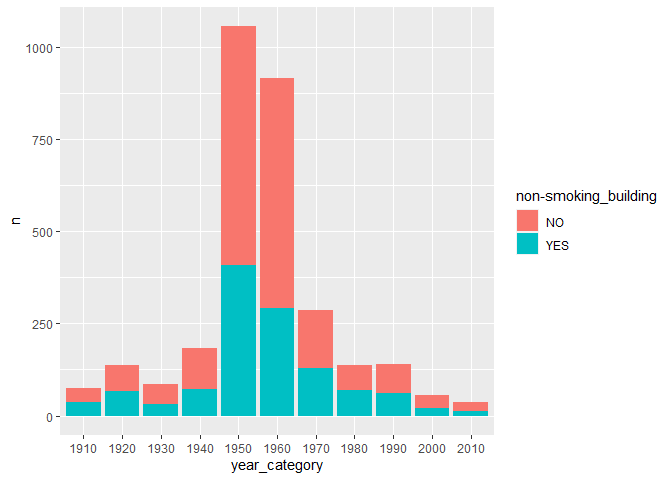
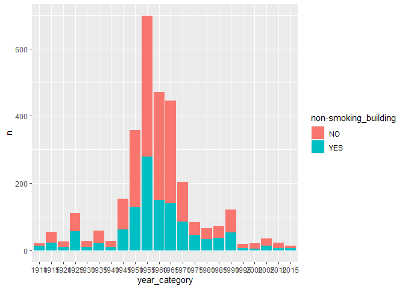
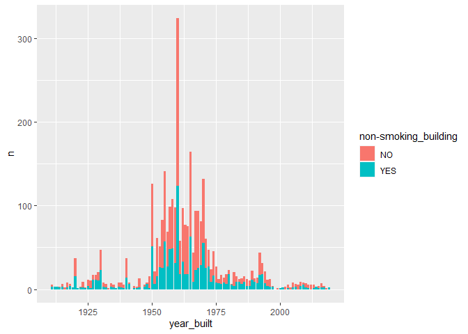
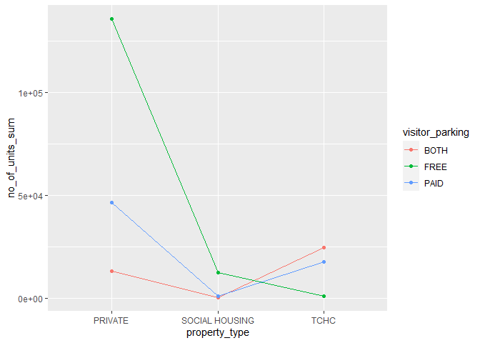
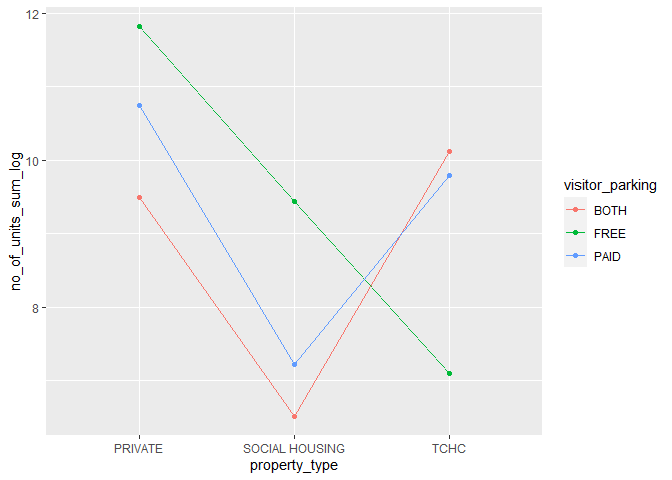
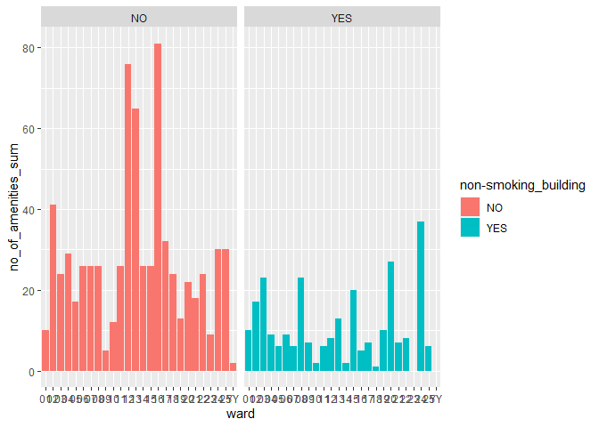

Mini Data Analysis 2
================
Jana Osea
October 18, 2021

# 0 Introduction

This file goes through my data exploration to answer some questions as
outlined in the [first mini data
analysis](https://github.com/stat545ubc-2021/jana-mini-data-analysis/blob/main/mini-data-analysis-1.md).
The data used is from the `datateachr` package. The project outline can
be [here](https://stat545.stat.ubc.ca/mini-project/mini-project-2/). I
will be documenting the data exploration tasks used for each research
question. First, we load the appropriate library packages.

``` r
suppressPackageStartupMessages(library(datateachr))
suppressPackageStartupMessages(library(tidyverse))
suppressPackageStartupMessages(library(tidyr))
suppressPackageStartupMessages(library(dplyr))
suppressPackageStartupMessages(library(ggridges))
suppressPackageStartupMessages(library(ggplot2))
suppressPackageStartupMessages(library(kableExtra))
```

# 1 Process and summarize your data

## 1.1 Research Questions

First, I write out the 4 research questions defined in milestone 1.

1.  Do certain property types prefer building apartments with a certain
    number of units?
2.  Is there are trend on the number of units built in smoking apartment
    buildings from 1910 to 2020?
3.  Does the number of units change according to property type for
    certain visitor parking types?
4.  For apartments with indoor pools, does the total number of units
    change according to ward?

## 1.2 Summarizing and Graphing Tasks

Now, for each of four research questions, I choose one task from options
1-4 (summarizing), and one other task from 4-8 (graphing).

**Summarizing:**

1.  Compute the *range*, *mean*, and *two other summary statistics* of
    **one numerical variable** across the groups of **one categorical
    variable** from your data.
2.  Compute the number of observations for at least one of your
    categorical variables. Do not use the function `table()`!
3.  Create a categorical variable with 3 or more groups from an existing
    numerical variable. You can use this new variable in the other
    tasks! *An example: age in years into “child, teen, adult, senior”.*
4.  Based on two categorical variables, calculate two summary statistics
    of your choosing.

**Graphing:**

5.  Create a graph out of summarized variables that has at least two
    geom layers.
6.  Create a graph of your choosing, make one of the axes logarithmic,
    and format the axes labels so that they are “pretty” or easier to
    read.
7.  Make a graph where it makes sense to customize the alpha
    transparency.
8.  Create 3 histograms out of summarized variables, with each histogram
    having different sized bins. Pick the “best” one and explain why it
    is the best.

### 1.2.1 Research Question 1

The first research question is: Do certain property types prefer
building apartments with a certain number of units?

#### 1.2.1.1 Task 1: Summary Statistics

The task is to compute the *range*, *mean*, and *two other summary
statistics* of **one numerical variable** across the groups of **one
categorical variable** from your data. This allows us to explore the
distribution of values for number of units within different property
types.

``` r
# determine outliers
outliers <- boxplot.stats(apt_buildings$no_of_units)$out 

# make tibble data frame 
apt_buildings %>% 
  filter(!no_of_units %in% outliers) %>% # get rid of outliers
  group_by(property_type) %>%
  summarise(
    count = n(),
    mean = mean(no_of_units),
    sum = sum(no_of_units),
    ) -> apt_buildings1

# show the summary statistics
apt_buildings %>% 
  filter(!no_of_units %in% outliers) %>% # get rid of outliers
  group_by(property_type) %>%
  summarise(
    count = n(),
    range = range(no_of_units),
    mean = mean(no_of_units),
    sum = sum(no_of_units),
    )
```

    ## `summarise()` has grouped output by 'property_type'. You can override using the `.groups` argument.

    ## # A tibble: 6 x 5
    ## # Groups:   property_type [3]
    ##   property_type  count range  mean    sum
    ##   <chr>          <int> <dbl> <dbl>  <dbl>
    ## 1 PRIVATE         2730     0  68.0 185695
    ## 2 PRIVATE         2730   272  68.0 185695
    ## 3 SOCIAL HOUSING   239    10  82.0  19599
    ## 4 SOCIAL HOUSING   239   264  82.0  19599
    ## 5 TCHC             278    11 111.   30920
    ## 6 TCHC             278   266 111.   30920

#### 1.2.1.2 Task 5: Graph Summary Statistics

The task is to create a graph out of summarized variables that has at
least two geom layers. I chose to use a violin plot as it shows the data
distribution of the number of units over the different property types in
an explicit way. In addition, we are able to explicitly see the
different quantiles.

``` r
apt_buildings %>% 
  filter(!no_of_units %in% outliers) %>% # get rid of outliers
  group_by(property_type) %>%
  ggplot(aes(x=property_type, y=no_of_units, color=property_type)) +
  geom_violin()+ 
  geom_boxplot(width=0.1)
```

<!-- -->

### 1.2.2 Research Question 2

The second research question is: Is there are trend on the number of
units built in smoking apartment buildings from 1910 to 2020?

#### 1.2.2.1 Tasks 2: Compute observations

The task is to compute the number of observations for at least one of
your categorical variables. Do not use the function `table()`! In this
case, I created 3 different tibble data frames that count the data by
different bins of years. `apt_buildings2.1` , `apt_buildings2.2`, and
`apt_buildings2.3` are grouped by 10 years, 5 years, and 1 year
correspondingly. The reason I did this was so that I can create
visualizations as a secondary task to determine which bin would be the
most useful ie. convey the same information without loss of generality.
It is also good to note that I am summing over the *no\_of\_units* of
each group since that is a more accurate number to count rather than
just the counts of each observation. In addition, I added the extra
column of describing property type as I potentially would like to
explore how this factor can affect the number smoking units.

``` r
# task 3
apt_buildings %>%
  filter(!is.na(`non-smoking_building`)) %>%
  filter(!no_of_units %in% outliers) %>%
  mutate(year = as.Date(as.character(year_built), format="%Y")) %>%
  filter(year > as.Date("1910", format="%Y")) %>%
  mutate(year_category=cut(year_built, breaks=c(-Inf,seq(1910, 2020, 10)), labels=paste(seq(1900, 2010, 10)))) %>%
  group_by(year_category, property_type) %>%
  count(`non-smoking_building`) -> apt_buildings2.1 # bin by 10

apt_buildings %>%
  filter(!is.na(`non-smoking_building`)) %>%
  filter(!no_of_units %in% outliers) %>%
  mutate(year = as.Date(as.character(year_built), format="%Y")) %>%
  filter(year > as.Date("1910", format="%Y")) %>%
  mutate(year_category=cut(year_built, breaks=c(-Inf, seq(1905, 2020, 5)), labels=paste(seq(1900, 2015, 5)))) %>%
  group_by(year_category, property_type) %>%
  count(`non-smoking_building`) -> apt_buildings2.2 # bin by 5


apt_buildings %>%
  filter(!is.na(`non-smoking_building`)) %>%
  filter(!no_of_units %in% outliers) %>%
  mutate(year = as.Date(as.character(year_built), format="%Y")) %>%
  filter(year > as.Date("1910", format="%Y")) %>%
  group_by(year_built, property_type) %>%
  count(`non-smoking_building`) -> apt_buildings2.3 # bin by 1

apt_buildings2.1
```

    ## # A tibble: 51 x 4
    ## # Groups:   year_category, property_type [33]
    ##    year_category property_type  `non-smoking_building`     n
    ##    <fct>         <chr>          <chr>                  <int>
    ##  1 1910          PRIVATE        NO                        35
    ##  2 1910          PRIVATE        YES                       36
    ##  3 1910          SOCIAL HOUSING NO                         3
    ##  4 1910          TCHC           YES                        1
    ##  5 1920          PRIVATE        NO                        69
    ##  6 1920          PRIVATE        YES                       64
    ##  7 1920          SOCIAL HOUSING NO                         2
    ##  8 1920          TCHC           YES                        2
    ##  9 1930          PRIVATE        NO                        53
    ## 10 1930          PRIVATE        YES                       30
    ## # ... with 41 more rows

``` r
apt_buildings2.2
```

    ## # A tibble: 91 x 4
    ## # Groups:   year_category, property_type [60]
    ##    year_category property_type  `non-smoking_building`     n
    ##    <fct>         <chr>          <chr>                  <int>
    ##  1 1910          PRIVATE        NO                         6
    ##  2 1910          PRIVATE        YES                       14
    ##  3 1915          PRIVATE        NO                        29
    ##  4 1915          PRIVATE        YES                       22
    ##  5 1915          SOCIAL HOUSING NO                         3
    ##  6 1915          TCHC           YES                        1
    ##  7 1920          PRIVATE        NO                        16
    ##  8 1920          PRIVATE        YES                        9
    ##  9 1920          TCHC           YES                        1
    ## 10 1925          PRIVATE        NO                        53
    ## # ... with 81 more rows

``` r
apt_buildings2.3
```

    ## # A tibble: 301 x 4
    ## # Groups:   year_built, property_type [208]
    ##    year_built property_type  `non-smoking_building`     n
    ##         <dbl> <chr>          <chr>                  <int>
    ##  1       1911 PRIVATE        NO                         2
    ##  2       1911 PRIVATE        YES                        3
    ##  3       1912 PRIVATE        YES                        3
    ##  4       1913 PRIVATE        YES                        3
    ##  5       1914 PRIVATE        NO                         1
    ##  6       1914 PRIVATE        YES                        2
    ##  7       1915 PRIVATE        NO                         3
    ##  8       1915 PRIVATE        YES                        3
    ##  9       1916 PRIVATE        NO                         1
    ## 10       1916 SOCIAL HOUSING NO                         1
    ## # ... with 291 more rows

#### 1.2.2.2 Task 8: Choose Bins

The task is to create 3 histograms out of summarized variables, with
each histogram having different sized bins. Pick the “best” one and
explain why it is the best. The binning for the first 2 plots were made
manually due to the fact that `ggplot` is unable to make bins by year
when in the `stat="identity"` mode. I had to use the `stat="identity"`
mode since I am not actually using the counts of the data but rather
taking the sum of *no\_of\_units* column by groups. Hence, the graphs
are actually “self” made histograms made by `geom_bar`. Regardless, the
goal which is to find which binning is appropriate can still be
achieved. Looking at the 3 different bins, I believe that the “best” one
would be the first one because the information is the same but with less
groupings. However, it is still somewhat difficult to see if there is an
apparent trend in the number of smoking buildings over the years.

``` r
# task 8
# bin by 10
apt_buildings2.1 %>%
  ggplot(aes(x=year_category, y=n, fill=`non-smoking_building`)) +  
  geom_bar(stat="identity")
```

<!-- -->

``` r
# bin by 5
apt_buildings2.2 %>%
  ggplot(aes(x=year_category, y=n, fill=`non-smoking_building`)) +  
  geom_bar(stat="identity")
```

<!-- -->

``` r
# bin by 1
apt_buildings2.3 %>%
  ggplot(aes(x=year_built, y=n, fill=`non-smoking_building`)) +  
  geom_bar(stat="identity")
```

<!-- -->

### 1.2.3 Research Question 3

The third research question is: Does the number of units change
according to property type for certain visitor parking types?

#### 1.2.3.1 Task 2: Compute Observations

The task is to compute the number of observations for at least one of
your categorical variables. Do not use the function `table()`! Similar
to 1.2.2.1, it is more useful to use to actually sum over the
*no\_of\_units* as it more accurately represents the apartment units
buils over the groupings. I also calculate the *no\_of\_units\_sum\_log*
as I wanted to see if the values work better on a log scale.

``` r
# task 2
apt_buildings %>%
  filter(!is.na(visitor_parking)) %>%
  filter(!is.na(property_type)) %>%
  filter(!visitor_parking == "UNAVAILABLE") %>% 
  group_by(property_type, visitor_parking) %>%
  summarise(no_of_units_sum=sum(no_of_units)) %>%
  mutate(no_of_units_sum_log = log(no_of_units_sum))-> apt_buildings3
```

    ## `summarise()` has grouped output by 'property_type'. You can override using the `.groups` argument.

``` r
apt_buildings3
```

    ## # A tibble: 9 x 4
    ## # Groups:   property_type [3]
    ##   property_type  visitor_parking no_of_units_sum no_of_units_sum_log
    ##   <chr>          <chr>                     <dbl>               <dbl>
    ## 1 PRIVATE        BOTH                      13370                9.50
    ## 2 PRIVATE        FREE                     135656               11.8 
    ## 3 PRIVATE        PAID                      46486               10.7 
    ## 4 SOCIAL HOUSING BOTH                        681                6.52
    ## 5 SOCIAL HOUSING FREE                      12521                9.44
    ## 6 SOCIAL HOUSING PAID                       1371                7.22
    ## 7 TCHC           BOTH                      24727               10.1 
    ## 8 TCHC           FREE                       1222                7.11
    ## 9 TCHC           PAID                      17837                9.79

#### 1.2.3.2 Task 5: Graph Summary Statistics

The task is to create a graph out of summarized variables that has at
least two geom layers. I created 2 graphs that plotted the
*no\_of\_units\_sum* by group where the x-axis represents the property
type and the different lines represent parking type. If a certain
property type does not affect the parking type, then the lines should be
coincidental. It is clear that there is an effect because the lines are
not coincidental. In addition, I plotted the log-scale of the sum of the
number of units. It is even more evident that there is an effect.

``` r
# task 5
apt_buildings3 %>% 
  ggplot(aes(x=property_type, y=no_of_units_sum, colour=visitor_parking, group=visitor_parking)) +
  geom_line() +
  geom_point()
```

<!-- -->

``` r
apt_buildings3 %>% 
  ggplot(aes(x=property_type, y=no_of_units_sum_log, colour=visitor_parking, group=visitor_parking)) +
  geom_line() +
  geom_point()
```

<!-- -->

### 1.2.4 Research Question 4

The fourth research question is: for apartments with indoor pools, does
the total number of units change according to ward?

#### 1.2.4.1 Task 2: Compute Observations

The task is to compute the number of observations for at least one of
your categorical variables. Do not use the function `table()`! I wanted
to broaden the scope of the research question to counting the number of
amenities by ward instead of just looking at the number of units that
have pools by ward. I think it is more interesting to look at the
overall number of amenities in each apartment building grouped by ward.
In addition, I also grouped it by smoking vs non-smoking units because I
think it would be interesting to see if there is a difference between
the two. Similar to the previous research questions, I compute the sum
of the *no\_of\_amenities* over each group instead of just adding the
counts of the number of observations since it is a more useful number to
work with and it reflects the actual target characteristic. It is good
to note that the number of amenities was first taken by processing the
*amenities* column which is reflected in the first few lines of code
below.

``` r
# task 2
# count number of amenities by splitting words
no_of_amenities <- rep(0, nrow(apt_buildings))
for(i in 1:nrow(apt_buildings)) {
  amenities = apt_buildings$amenities[i]
  if(!is.na(amenities)) {
    no_of_amenities[i] = length(str_split(amenities, " ,")[[1]])
  }
}

# bind the number of amenities as a new column in the apt_buildings tibble df
cbind(apt_buildings, no_of_amenities) -> apt_buildings

apt_buildings %>%
  na.omit() %>%
  group_by(ward, `non-smoking_building`) %>%
  summarise(no_of_amenities_sum=sum(no_of_amenities)) -> apt_buildings4
```

    ## `summarise()` has grouped output by 'ward'. You can override using the `.groups` argument.

``` r
apt_buildings4
```

    ## # A tibble: 50 x 3
    ## # Groups:   ward [26]
    ##    ward  `non-smoking_building` no_of_amenities_sum
    ##    <chr> <chr>                                <dbl>
    ##  1 01    NO                                      10
    ##  2 01    YES                                     10
    ##  3 02    NO                                      41
    ##  4 02    YES                                     17
    ##  5 03    NO                                      24
    ##  6 03    YES                                     23
    ##  7 04    NO                                      29
    ##  8 04    YES                                      9
    ##  9 05    NO                                      17
    ## 10 05    YES                                      6
    ## # ... with 40 more rows

#### 1.2.4.2 Task 5: Graph Summary Statistics

The task is to create a graph out of summarized variables that has at
least two geom layers. I chose to highlight difference between the
number of amenities present in the wards by smoking and non-smoking
groups by creating 2 side-by-side graphs. This allows us to more easily
see the differences in the shape and distribution. It is somewhat
obvious that there is a difference.

``` r
# task 5
apt_buildings4  %>%
  ggplot(aes(x=ward, y=no_of_amenities_sum, fill=`non-smoking_building`)) +
  geom_bar(stat="identity") +
  facet_wrap(~`non-smoking_building`)
```

<!-- -->

## 1.3 Research Question Reflection

Here is the list of my research questions for quick reference:

1.  Do certain property types prefer building apartments with a certain
    number of units?
2.  Is there are trend on the number of units built in smoking apartment
    buildings from 1910 to 2020?
3.  Does the number of units change according to property type for
    certain visitor parking types?
4.  For apartments with indoor pools, does the total number of units
    change according to ward?

Below are my reflections so far.

**Based on the operations that you’ve completed, how much closer are you
to answering your research questions?**

Based on the tasks completed, all of the research questions have been
explored–however, some questions have shown to be more interesting than
others. I think for all of them, the visualizations provide a very good
overview of the general answers. However, it is hard to say for certain
that we are confident in the “feel” that these visualizations give. It
would be more helpful if some sort of hypothesis testing or modelling
can be done. This is where the data can help.

**Think about what aspects of your research questions remain unclear.**

For research question (2), although I have decided which bin I would
like to use to explore the trend, it is still unclear if there is a
definite trend in the number of non-smoking versus smoking buildings
that were built from 1910 to 2020. I think some sort of time series
analysis can be done. It would also be good if I could potentially group
by certain categorical variables that can affect this number. More data
manipulations can be done to explore this topic. For research question
(4), I decided to broaden the scope to counting the number of amenities
grouped by ward and smoking type. Although I think this is interesting,
I think it would be good if I could explore potential other variables
that can affect this number. I think it would clarify why there could be
a reason why this number varies over the wards.

**Can your research questions be refined, now that you’ve investigated
your data a bit more?**

I think overall, the research questions have a good scope aside from the
changes aspects that can be clarified as pointed out in point 2. I
definitely think that as more data exploration is done, the research
questions will definitely be more clear and the goal more defined.

**Which research questions are yielding interesting results?**

Like I have mentioned, some research questions are more interesting than
others. For example, I think research question (1) simply just asks if
certain property types prefer building apartments with a certain number
of units. I think it would be more interesting if the research question
could broaden its scope to asking if certain property types prefer to
build apartments with certain aspects like: window pane type or amenity
type. Hence, I think it is more interesting to explore topics as
mentioned in research question (2) or (4) since they already start
looking at other variables that can affect the response variable.

# 2 Tidy your data

A reminder of the definition of *tidy* data:

-   Each row is an **observation**
-   Each column is a **variable**
-   Each cell is a **value**

*Tidy’ing* data is sometimes necessary because it can simplify
computation. Other times it can be nice to organize data so that it can
be easier to understand when read manually.

## 2.1 Identifying Tidy data

First we take a look at the data using `glimpse`

``` r
glimpse(apt_buildings)
```

    ## Rows: 3,455
    ## Columns: 38
    ## $ id                               <dbl> 10359, 10360, 10361, 10362, 10363, 10~
    ## $ air_conditioning                 <chr> "NONE", "NONE", "NONE", "NONE", "NONE~
    ## $ amenities                        <chr> "Outdoor rec facilities", "Outdoor po~
    ## $ balconies                        <chr> "YES", "YES", "YES", "YES", "NO", "NO~
    ## $ barrier_free_accessibilty_entr   <chr> "YES", "NO", "NO", "YES", "NO", "NO",~
    ## $ bike_parking                     <chr> "0 indoor parking spots and 10 outdoo~
    ## $ exterior_fire_escape             <chr> "NO", "NO", "NO", "YES", "NO", NA, "N~
    ## $ fire_alarm                       <chr> "YES", "YES", "YES", "YES", "YES", "Y~
    ## $ garbage_chutes                   <chr> "YES", "YES", "NO", "NO", "NO", "NO",~
    ## $ heating_type                     <chr> "HOT WATER", "HOT WATER", "HOT WATER"~
    ## $ intercom                         <chr> "YES", "YES", "YES", "YES", "YES", "Y~
    ## $ laundry_room                     <chr> "YES", "YES", "YES", "YES", "YES", "Y~
    ## $ locker_or_storage_room           <chr> "NO", "YES", "YES", "YES", "NO", "YES~
    ## $ no_of_elevators                  <dbl> 3, 3, 0, 1, 0, 0, 0, 2, 4, 2, 0, 2, 2~
    ## $ parking_type                     <chr> "Underground Garage , Garage accessib~
    ## $ pets_allowed                     <chr> "YES", "YES", "YES", "YES", "YES", "Y~
    ## $ prop_management_company_name     <chr> NA, "SCHICKEDANZ BROS. PROPERTIES", N~
    ## $ property_type                    <chr> "PRIVATE", "PRIVATE", "PRIVATE", "PRI~
    ## $ rsn                              <dbl> 4154812, 4154815, 4155295, 4155309, 4~
    ## $ separate_gas_meters              <chr> "NO", "NO", "NO", "NO", "NO", "NO", "~
    ## $ separate_hydro_meters            <chr> "YES", "YES", "YES", "YES", "YES", "Y~
    ## $ separate_water_meters            <chr> "NO", "NO", "NO", "NO", "NO", "NO", "~
    ## $ site_address                     <chr> "65  FOREST MANOR RD", "70  CLIPPER R~
    ## $ sprinkler_system                 <chr> "YES", "YES", "NO", "YES", "NO", "NO"~
    ## $ visitor_parking                  <chr> "PAID", "FREE", "UNAVAILABLE", "UNAVA~
    ## $ ward                             <chr> "17", "17", "03", "03", "02", "02", "~
    ## $ window_type                      <chr> "DOUBLE PANE", "DOUBLE PANE", "DOUBLE~
    ## $ year_built                       <dbl> 1967, 1970, 1927, 1959, 1943, 1952, 1~
    ## $ year_registered                  <dbl> 2017, 2017, 2017, 2017, 2017, NA, 201~
    ## $ no_of_storeys                    <dbl> 17, 14, 4, 5, 4, 4, 4, 7, 32, 4, 4, 7~
    ## $ emergency_power                  <chr> "NO", "YES", "NO", "NO", "NO", "NO", ~
    ## $ `non-smoking_building`           <chr> "YES", "NO", "YES", "YES", "YES", "NO~
    ## $ no_of_units                      <dbl> 218, 206, 34, 42, 25, 34, 14, 105, 57~
    ## $ no_of_accessible_parking_spaces  <dbl> 8, 10, 20, 42, 12, 0, 5, 1, 1, 6, 12,~
    ## $ facilities_available             <chr> "Recycling bins", "Green Bin / Organi~
    ## $ cooling_room                     <chr> "NO", "NO", "NO", "NO", "NO", "NO", "~
    ## $ no_barrier_free_accessible_units <dbl> 2, 0, 0, 42, 0, NA, 14, 0, 0, 1, 25, ~
    ## $ no_of_amenities                  <dbl> 1, 1, 0, 0, 0, 0, 0, 3, 0, 1, 0, 0, 0~

There is clearly more than 8 columns, so we will only choose the columns
that I mostly used for the research questions. I will store the data in
the `apt_buildings5` data frame.

``` r
apt_buildings %>%
  select(id,
         no_of_amenities,
         property_type,
         visitor_parking,
         ward,
         year_built,
         `non-smoking_building`,
         no_of_units,
         pets_allowed # added to meet the 8 minimum requirement
         ) %>%
  na.omit() -> apt_buildings5
head(apt_buildings5)
```

    ##      id no_of_amenities property_type visitor_parking ward year_built
    ## 1 10359               1       PRIVATE            PAID   17       1967
    ## 2 10360               1       PRIVATE            FREE   17       1970
    ## 3 10361               0       PRIVATE     UNAVAILABLE   03       1927
    ## 4 10362               0       PRIVATE     UNAVAILABLE   03       1959
    ## 5 10363               0       PRIVATE     UNAVAILABLE   02       1943
    ## 6 10364               0       PRIVATE     UNAVAILABLE   02       1952
    ##   non-smoking_building no_of_units pets_allowed
    ## 1                  YES         218          YES
    ## 2                   NO         206          YES
    ## 3                  YES          34          YES
    ## 4                  YES          42          YES
    ## 5                  YES          25          YES
    ## 6                   NO          34          YES

Now we answer if the data is Tidy by addressing the following points:

-   Is each row an **observation**?

    It is clear that each row represents an observation where each
    observation is a specific apartment unit.

-   Is each column a **variable**?

    It is also clear that each column represents a certain aspect of
    each observation.

-   Is each cell a **value**?

    It can be seen that each cell represents a value taken on by each
    observation for that specific column variable.

Hence, the data set `apt_buildings5` is tidy!

## 2.2 Tidy to untidy or vice versa

For reference, here is a view of the data set `apt_buildings5` as a Tidy
data set.

``` r
head(apt_buildings5)
```

    ##      id no_of_amenities property_type visitor_parking ward year_built
    ## 1 10359               1       PRIVATE            PAID   17       1967
    ## 2 10360               1       PRIVATE            FREE   17       1970
    ## 3 10361               0       PRIVATE     UNAVAILABLE   03       1927
    ## 4 10362               0       PRIVATE     UNAVAILABLE   03       1959
    ## 5 10363               0       PRIVATE     UNAVAILABLE   02       1943
    ## 6 10364               0       PRIVATE     UNAVAILABLE   02       1952
    ##   non-smoking_building no_of_units pets_allowed
    ## 1                  YES         218          YES
    ## 2                   NO         206          YES
    ## 3                  YES          34          YES
    ## 4                  YES          42          YES
    ## 5                  YES          25          YES
    ## 6                   NO          34          YES

I take the categorical variable *property\_type* which take on the
values PRIVATE, TCHC, and SOCIAL HOUSING and use each value as its own
column variable which take on the value of the ward number. This means
that if an apartment is has a property type that is PRIVATE and is found
in ward 17, only the PRIVATE column will be filled while the other
columns TCHC and SOCIAL HOUSING are empty. In addition, the PRIVATE cell
for this apartment will be filled with the number 17. I store this
untidy data set in a data frame called `apt_buildings6`. Below is my
untidy operation along with an after look at the data frame.

``` r
apt_buildings5 %>%
  pivot_wider(names_from=property_type,
              values_from=ward) %>%
  as.data.frame()-> apt_buildings6
class(apt_buildings6)
```

    ## [1] "data.frame"

``` r
head(apt_buildings6)
```

    ##      id no_of_amenities visitor_parking year_built non-smoking_building
    ## 1 10359               1            PAID       1967                  YES
    ## 2 10360               1            FREE       1970                   NO
    ## 3 10361               0     UNAVAILABLE       1927                  YES
    ## 4 10362               0     UNAVAILABLE       1959                  YES
    ## 5 10363               0     UNAVAILABLE       1943                  YES
    ## 6 10364               0     UNAVAILABLE       1952                   NO
    ##   no_of_units pets_allowed PRIVATE TCHC SOCIAL HOUSING
    ## 1         218          YES      17 <NA>           <NA>
    ## 2         206          YES      17 <NA>           <NA>
    ## 3          34          YES      03 <NA>           <NA>
    ## 4          42          YES      03 <NA>           <NA>
    ## 5          25          YES      02 <NA>           <NA>
    ## 6          34          YES      02 <NA>           <NA>

I choose to untidy in in this way because it would be interesting to see
explore the grouping of property type by ward with respect to the
continuous variables like *no\_of\_units* or *no\_of\_amenities*. Having
it untidy in this way allows me to explore this grouping easier.

## 2.3 Choose Research Question

**Research Questions** Based on my exploration and reflections, I choose
the following research questions:

1.  Research question 2: Is there are trend on the number of units built
    in smoking apartment buildings from 1910 to 2020?

    Particularly, I think I can refine this question by asking what
    other factors can affect the trend in the number of smoking units
    versus non-smoking units over the years. I like this questions
    because I can perhaps create a time series model or even create more
    visualizations that include other factors in the analysis.

2.  Research question 4: For apartments with indoor pools, does the
    total number of units change according to ward?

    As mentioned in 1.2.4.1, I have already broadened the scope of this
    question by changing it to counting the number of amenities in each
    ward. This is really an interesting research question because we
    could potentially factors that affect why certain apartment
    buildings can have gyms or swimming pools over other apartment
    buildings.

**Data set**

These 2 research questions are grouped differently from each other. The
first one is grouped by years (binned by 10 years) and the second one is
grouped by ward. It would make sense to keep the data as raw as possible
ie. not much grouping or summarising already done before hand. Hence, I
only selected the columns that interested me using the `select`
function, got rid of unwanted outliers using `filter`, widened the
non-smoking building variable with values from *no\_of\_units* using
`pivot_wider` and changed the *year\_built* variable from a string to a
Date format using `mutate`. Below is my process of creating my final
data set and a preview of the data.

``` r
apt_buildings %>%
  select(id,
         no_of_amenities,
         property_type,
         visitor_parking,
         ward,
         year_built,
         `non-smoking_building`,
         no_of_units,
         pets_allowed,
         heating_type,
         balconies,
         air_conditioning
         ) %>%
  filter(!no_of_units %in% outliers) %>%
  pivot_wider(names_from=`non-smoking_building`,
              values_from=no_of_units) %>%
  mutate(year = as.Date(as.character(year_built), format="%Y")) %>%
  as.data.frame() %>%
  head()
```

    ##      id no_of_amenities property_type visitor_parking ward year_built
    ## 1 10359               1       PRIVATE            PAID   17       1967
    ## 2 10360               1       PRIVATE            FREE   17       1970
    ## 3 10361               0       PRIVATE     UNAVAILABLE   03       1927
    ## 4 10362               0       PRIVATE     UNAVAILABLE   03       1959
    ## 5 10363               0       PRIVATE     UNAVAILABLE   02       1943
    ## 6 10364               0       PRIVATE     UNAVAILABLE   02       1952
    ##   pets_allowed heating_type balconies air_conditioning YES  NO NA       year
    ## 1          YES    HOT WATER       YES             NONE 218  NA NA 1967-10-19
    ## 2          YES    HOT WATER       YES             NONE  NA 206 NA 1970-10-19
    ## 3          YES    HOT WATER       YES             NONE  34  NA NA 1927-10-19
    ## 4          YES    HOT WATER       YES             NONE  42  NA NA 1959-10-19
    ## 5          YES    HOT WATER        NO             NONE  25  NA NA 1943-10-19
    ## 6          YES    HOT WATER        NO             NONE  NA  34 NA 1952-10-19
