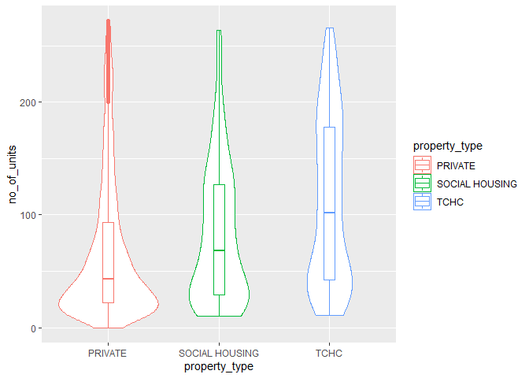
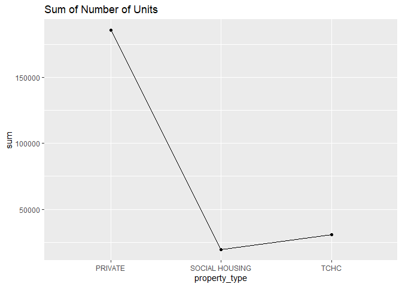

Mini Data Analysis Milestone 2
================

*To complete this milestone, you can either edit [this `.rmd`
file](https://raw.githubusercontent.com/UBC-STAT/stat545.stat.ubc.ca/master/content/mini-project/mini-project-2.Rmd)
directly. Fill in the sections that are commented out with
`<!--- start your work here--->`. When you are done, make sure to knit
to an `.md` file by changing the output in the YAML header to
`github_document`, before submitting a tagged release on canvas.*

# Welcome back to your mini data analysis project!

This time, we will explore more in depth the concept of *tidy data*, and
hopefully investigate further into your research questions that you
defined in milestone 1.

**NOTE**: The main purpose of the mini data analysis is to integrate
what you learn in class in an analysis. Although each milestone provides
a framework for you to conduct your analysis, it’s possible that you
might find the instructions too rigid for your data set. If this is the
case, you may deviate from the instructions – just make sure you’re
demonstrating a wide range of tools and techniques taught in this class.

Begin by loading your data and the tidyverse package below:

``` r
suppressPackageStartupMessages(library(datateachr))
suppressPackageStartupMessages(library(tidyverse))
suppressPackageStartupMessages(library(dplyr))
suppressPackageStartupMessages(library(ggridges))
suppressPackageStartupMessages(library(ggplot2))
suppressPackageStartupMessages(library(kableExtra))
```

# Learning Objectives

By the end of this milestone, you should:

-   Become familiar with manipulating and summarizing your data in
    tibbles using `dplyr` and `tidyr`, with a research question in mind.
-   Understand what *tidy* data is, and how to create it. In milestone
    3, we will explore when this might be useful.
-   Generate a reproducible and clear report using R Markdown.
-   Gain a greater understanding of how to use R to answer research
    questions about your data.

**Things to keep in mind**

-   Remember to document your code, be explicit about what you are
    doing, and write notes in this markdown document when you feel that
    context is required. Create your analysis as if someone else will be
    reading it! **There will be 2.5 points reserved for reproducibility,
    readability, and repo organization.**

-   Before working on each task, you should always keep in mind the
    specific **research question** that you’re trying to answer.

# Task 1: Process and summarize your data (15 points)

From milestone 1, you should have an idea of the basic structure of your
dataset (e.g. number of rows and columns, class types, etc.). Here, we
will start investigating your data more in-depth using various data
manipulation functions.

### 1.1 (2.5 points)

First, write out the 4 research questions you defined in milestone 1
were. This will guide your work through milestone 2:

1.  apt\_buildings
2.  building\_permits
3.  parking\_meters
4.  vancouver\_trees

### 1.2 (10 points)

Now, for each of your four research questions, choose one task from
options 1-4 (summarizing), and one other task from 4-8 (graphing). You
should have 2 tasks done for each research question (8 total). Make sure
it makes sense to do them! (e.g. don’t use a numerical variables for a
task that needs a categorical variable.). Comment on why each task helps
(or doesn’t!) answer the corresponding research question.

Ensure that the output of each operation is printed!

**Summarizing:**

1.  Compute the *range*, *mean*, and *two other summary statistics* of
    **one numerical variable** across the groups of **one categorical
    variable** from your data.
2.  Compute the number of observations for at least one of your
    categorical variables. Do not use the function `table()`!
3.  Create a categorical variable with 3 or more groups from an existing
    numerical variable. You can use this new variable in the other
    tasks! *An example: age in years into “child, teen, adult, senior”.*
4.  Based on two categorical variables, calculate two summary statistics
    of your choosing.

**Graphing:**

5.  Create a graph out of summarized variables that has at least two
    geom layers.
6.  Create a graph of your choosing, make one of the axes logarithmic,
    and format the axes labels so that they are “pretty” or easier to
    read.
7.  Make a graph where it makes sense to customize the alpha
    transparency.
8.  Create 3 histograms out of summarized variables, with each histogram
    having different sized bins. Pick the “best” one and explain why it
    is the best.

Make sure it’s clear what research question you are doing each operation
for!

#### 1.2.1 Research Question 1

The first research question is: Do certain property types prefer
building apartments with a certain number of units?

##### 1.2.1.1 Task 1: Summary Statistics

The task is to compute the *range*, *mean*, and *two other summary
statistics* of **one numerical variable** across the groups of **one
categorical variable** from your data.

``` r
# determine outliers
outliers <- boxplot.stats(apt_buildings$no_of_units)$out 

# make tibble data frame 
apt_buildings %>% 
  filter(!no_of_units %in% outliers) %>% # get rid of outliers
  group_by(property_type) %>%
  summarise(
    count = n(),
    mean = mean(no_of_units),
    sum = sum(no_of_units),
    ) -> apt_buildings1

# show the summary statistics
apt_buildings %>% 
  filter(!no_of_units %in% outliers) %>% # get rid of outliers
  group_by(property_type) %>%
  summarise(
    count = n(),
    range = range(no_of_units),
    mean = mean(no_of_units),
    sum = sum(no_of_units),
    )
```

    ## `summarise()` has grouped output by 'property_type'. You can override using the `.groups` argument.

    ## # A tibble: 6 x 5
    ## # Groups:   property_type [3]
    ##   property_type  count range  mean    sum
    ##   <chr>          <int> <dbl> <dbl>  <dbl>
    ## 1 PRIVATE         2730     0  68.0 185695
    ## 2 PRIVATE         2730   272  68.0 185695
    ## 3 SOCIAL HOUSING   239    10  82.0  19599
    ## 4 SOCIAL HOUSING   239   264  82.0  19599
    ## 5 TCHC             278    11 111.   30920
    ## 6 TCHC             278   266 111.   30920

##### 1.2.1.2 Task 5: Graph Summary Statistics

The task is to create a graph out of summarized variables that has at
least two geom layers.

``` r
apt_buildings1 %>% 
  ggplot(aes(x=property_type, y=mean, group=1)) +
  geom_line() +
  geom_point()+ 
  ggtitle("Mean of Number of Units")
```

<!-- -->

``` r
apt_buildings1 %>% 
  ggplot(aes(x=property_type, y=sum, group=1)) +
  geom_line() +
  geom_point() + 
  ggtitle("Sum of Number of Units")
```

<!-- -->

#### 1.2.2 Research Question 2

The second research question is: Is there are trend on the number of
units built in smoking apartment buildings from 1910 to 2020?

##### 1.2.1.2 Task 1: Summary Statistics

The task is to

##### 1.2.1.2 Task 8: 8. Create 3 Histograms.

The task is to

#### 1.2.2 Research Question 2

The second research question is: Do certain property types prefer
building apartments with a certain number of units?

##### 1.2.1.2 Task 1: Summary Statistics

The task is to

##### 1.2.1.2 Task 8: 8. Create 3 Histograms.

The task is to

### 1.3 (2.5 points)

Based on the operations that you’ve completed, how much closer are you
to answering your research questions? Think about what aspects of your
research questions remain unclear. Can your research questions be
refined, now that you’ve investigated your data a bit more? Which
research questions are yielding interesting results?

<!------------------------- Write your answer here ---------------------------->
<!----------------------------------------------------------------------------->

# Task 2: Tidy your data (12.5 points)

In this task, we will do several exercises to reshape our data. The goal
here is to understand how to do this reshaping with the `tidyr` package.

A reminder of the definition of *tidy* data:

-   Each row is an **observation**
-   Each column is a **variable**
-   Each cell is a **value**

*Tidy’ing* data is sometimes necessary because it can simplify
computation. Other times it can be nice to organize data so that it can
be easier to understand when read manually.

### 2.1 (2.5 points)

Based on the definition above, can you identify if your data is tidy or
untidy? Go through all your columns, or if you have &gt;8 variables,
just pick 8, and explain whether the data is untidy or tidy.

<!--------------------------- Start your work below --------------------------->
<!----------------------------------------------------------------------------->

### 2.2 (5 points)

Now, if your data is tidy, untidy it! Then, tidy it back to it’s
original state.

If your data is untidy, then tidy it! Then, untidy it back to it’s
original state.

Be sure to explain your reasoning for this task. Show us the “before”
and “after”.

<!--------------------------- Start your work below --------------------------->
<!----------------------------------------------------------------------------->

### 2.3 (5 points)

Now, you should be more familiar with your data, and also have made
progress in answering your research questions. Based on your interest,
and your analyses, pick 2 of the 4 research questions to continue your
analysis in milestone 3, and explain your decision.

Try to choose a version of your data that you think will be appropriate
to answer these 2 questions in milestone 3. Use between 4 and 8
functions that we’ve covered so far (i.e. by filtering, cleaning,
tidy’ing, dropping irrelvant columns, etc.).

fdfasdfasdf

<!----------------------------------------------------------------------------->

*When you are done, knit an `md` file. This is what we will mark! Make
sure to open it and check that everything has knitted correctly before
submitting your tagged release.*

### Attribution

Thanks to Victor Yuan for mostly putting this together.
