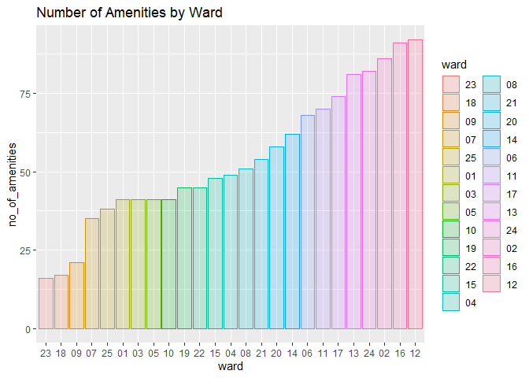
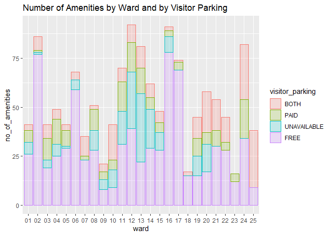

Mini Data Analysis 3
================
Jana Osea
October 28, 2021

# Setup

Begin by loading your data and the tidyverse package below:

``` r
suppressPackageStartupMessages(library(datateachr)) # <- might contain the data you picked!
suppressPackageStartupMessages(library(tidyverse))
suppressPackageStartupMessages(library(forcats))
suppressPackageStartupMessages(library(tidyr))
suppressPackageStartupMessages(library(dplyr))
suppressPackageStartupMessages(library(ggridges))
suppressPackageStartupMessages(library(ggplot2))
suppressPackageStartupMessages(library(kableExtra))
suppressPackageStartupMessages(library(lubridate))
```

After loading the appropriate packages, I load the data as processed in
the previous milestone.

``` r
# LOAD DATA
# count number of amenities by splitting words
no_of_amenities <- rep(0, nrow(apt_buildings))
for(i in 1:nrow(apt_buildings)) {
  amenities = apt_buildings$amenities[i]
  if(!is.na(amenities)) {
    no_of_amenities[i] = length(str_split(amenities, " ,")[[1]])
  }
}

# determine outliers
outliers <- boxplot.stats(apt_buildings$no_of_units)$out 


# bind the number of amenities as a new column in the apt_buildings tibble df
cbind(apt_buildings, no_of_amenities) -> apt_buildings

apt_buildings %>%
  select(id,
         no_of_amenities,
         property_type,
         visitor_parking,
         ward,
         year_built,
         `non-smoking_building`,
         no_of_units,
         pets_allowed,
         heating_type,
         balconies,
         air_conditioning
         ) %>%
  filter(!no_of_units %in% outliers) %>%
  mutate(year_built = year(as_date(year_built)))-> apt_buildings
```

## Research Questions

1.  Do various apartment characteristics like number of balconies,
    whether pets are allowed, and air conditioning type affect the trend
    of the number of smoking/non-smoking apartment units from 1910 to
    2020?
2.  What are similar characteristics in each ward with lower number of
    amenities versus higher?

# Exercise 1: Special Data Types

**Task 1**: I choose to reorder the column *ward* in the *apt\_building*
data set so that I am able to better visualize which wards have more
total number of amenities. It also allows us to see which wards have
similar total number of amenities.

``` r
apt_buildings %>%
  group_by(ward) %>%
  summarise(no_of_amenities = sum(no_of_amenities)) %>%
  mutate(ward = fct_reorder(ward, no_of_amenities)) %>%
  ggplot(aes(x=ward, y=no_of_amenities, color=ward, fill=ward)) + 
  geom_bar(stat="identity", alpha=0.2) + 
  ggtitle("Number of Amenities by Ward")
```

<!-- -->

**Task 2**: The column *visitor\_parking* column has *UNAVAILABLE* as an
option, however there are also data points with *NA* as input. Hence, I
used the `fct_collapse` along with `addNA` function in order to combine
the *UNAVAILABLE* option with the *NA* option. This allows us to still
include the number of NA’s into the analysis.

``` r
apt_buildings$visitor_parking  <- fct_collapse(addNA(apt_buildings$visitor_parking),
                                               UNAVAILABLE = c("UNAVAILABLE", NA))


apt_buildings %>%
  group_by(ward, visitor_parking) %>%
  summarise(no_of_amenities = sum(no_of_amenities), 
            no_of_unit = sum(no_of_units)) %>%
  mutate(visitor_parking = fct_reorder(visitor_parking, no_of_amenities)) %>%
  ggplot(aes(x=ward, y=no_of_amenities, fill=visitor_parking, color=visitor_parking)) +
  geom_bar(stat="identity", alpha=0.2) +
  ggtitle("Number of Amenities by Ward and by Visitor Parking")
```

    ## `summarise()` has grouped output by 'ward'. You can override using the `.groups` argument.

<!-- -->

# Exercise 2: Modelling

## 2.0 (no points)

Pick a research question, and pick a variable of interest (we’ll call it
“Y”) that’s relevant to the research question. Indicate these.

<!-------------------------- Start your work below ---------------------------->

**Research Question**: FILL\_THIS\_IN

**Variable of interest**: FILL\_THIS\_IN

<!----------------------------------------------------------------------------->

## 2.1 (5 points)

Fit a model or run a hypothesis test that provides insight on this
variable with respect to the research question. Store the model object
as a variable, and print its output to screen. We’ll omit having to
justify your choice, because we don’t expect you to know about model
specifics in STAT 545.

-   **Note**: It’s OK if you don’t know how these models/tests work.
    Here are some examples of things you can do here, but the sky’s the
    limit.
    -   You could fit a model that makes predictions on Y using another
        variable, by using the `lm()` function.
    -   You could test whether the mean of Y equals 0 using `t.test()`,
        or maybe the mean across two groups are different using
        `t.test()`, or maybe the mean across multiple groups are
        different using `anova()` (you may have to pivot your data for
        the latter two).
    -   You could use `lm()` to test for significance of regression.

<!-------------------------- Start your work below ---------------------------->
<!----------------------------------------------------------------------------->

## 2.2 (5 points)

Produce something relevant from your fitted model: either predictions on
Y, or a single value like a regression coefficient or a p-value.

-   Be sure to indicate in writing what you chose to produce.
-   Your code should either output a tibble (in which case you should
    indicate the column that contains the thing you’re looking for), or
    the thing you’re looking for itself.
-   Obtain your results using the `broom` package if possible. If your
    model is not compatible with the broom function you’re needing, then
    you can obtain your results by some other means, but first indicate
    which broom function is not compatible.

<!-------------------------- Start your work below ---------------------------->
<!----------------------------------------------------------------------------->

# Exercise 3: Reading and writing data

Get set up for this exercise by making a folder called `output` in the
top level of your project folder / repository. You’ll be saving things
there.

## 3.1 (5 points)

Take a summary table that you made from Milestone 2 (Exercise 1.2), and
write it as a csv file in your `output` folder. Use the `here::here()`
function.

-   **Robustness criteria**: You should be able to move your Mini
    Project repository / project folder to some other location on your
    computer, or move this very Rmd file to another location within your
    project repository / folder, and your code should still work.
-   **Reproducibility criteria**: You should be able to delete the csv
    file, and remake it simply by knitting this Rmd file.

<!-------------------------- Start your work below ---------------------------->
<!----------------------------------------------------------------------------->

## 3.2 (5 points)

Write your model object from Exercise 2 to an R binary file (an RDS),
and load it again. Be sure to save the binary file in your `output`
folder. Use the functions `saveRDS()` and `readRDS()`.

-   The same robustness and reproducibility criteria as in 3.1 apply
    here.

<!-------------------------- Start your work below ---------------------------->
<!----------------------------------------------------------------------------->

# Tidy Repository

Now that this is your last milestone, your entire project repository
should be organized. Here are the criteria we’re looking for.

## Main README (3 points)

There should be a file named `README.md` at the top level of your
repository. Its contents should automatically appear when you visit the
repository on GitHub.

Minimum contents of the README file:

-   In a sentence or two, explains what this repository is, so that
    future-you or someone else stumbling on your repository can be
    oriented to the repository.
-   In a sentence or two (or more??), briefly explains how to engage
    with the repository. You can assume the person reading knows the
    material from STAT 545A. Basically, if a visitor to your repository
    wants to explore your project, what should they know?

Once you get in the habit of making README files, and seeing more README
files in other projects, you’ll wonder how you ever got by without them!
They are tremendously helpful.

## File and Folder structure (3 points)

You should have at least four folders in the top level of your
repository: one for each milestone, and one output folder. If there are
any other folders, these are explained in the main README.

Each milestone document is contained in its respective folder, and
nowhere else.

Every level-1 folder (that is, the ones stored in the top level, like
“Milestone1” and “output”) has a `README` file, explaining in a sentence
or two what is in the folder, in plain language (it’s enough to say
something like “This folder contains the source for Milestone 1”).

## Output (2 points)

All output is recent and relevant:

-   All Rmd files have been `knit`ted to their output, and all data
    files saved from Exercise 3 above appear in the `output` folder.
-   All of these output files are up-to-date – that is, they haven’t
    fallen behind after the source (Rmd) files have been updated.
-   There should be no relic output files. For example, if you were
    knitting an Rmd to html, but then changed the output to be only a
    markdown file, then the html file is a relic and should be deleted.

Our recommendation: delete all output files, and re-knit each
milestone’s Rmd file, so that everything is up to date and relevant.

PS: there’s a way where you can run all project code using a single
command, instead of clicking “knit” three times. More on this in STAT
545B!

## Error-free code (1 point)

This Milestone 3 document knits error-free. (We’ve already graded this
aspect for Milestone 1 and 2)

## Tagged release (1 point)

You’ve tagged a release for Milestone 3. (We’ve already graded this
aspect for Milestone 1 and 2)
